# Datum design requirements: Markdown edition

This is the Markdown edition of the published design requirements page. Diagrams are in `diagrams/`, screenshots in `snapshots/`. The tags **Decided**, **Example** and **Prototype simplification** carry the same meaning as in the page. Role tags [FE] [BE] [AI] show likely owners of the real component.

---

One reference for what the product does, what has been decided, what is only example content, and where the prototype stands in for something that has not been designed yet.

*\[Prepared Oct 8, 2026\]* *\[For Aaron, the design co-founder, FE, agentic AI and BE\]* *\[Baseline: Handoff v2 prototype plus the new search and catalogue design files\]*

This page accompanies the UI design guide (the `ui-design-current` design system, bundled in the prototype under `_ds/`). The guide says how things look. This page says what each screen is for, what it must do, which parts are firm, and what a developer should not build literally.

## How to read this

Every screen and feature below sorts its content into the same three groups. Items carry the tag so they can be scanned without reading the column heading.
**Decided**

A standing decision. Build to it. Where a value is configurable, the decision is that it is configurable.
**Example**

Illustrative content: names, numbers, status values, thresholds, file formats. It shows the shape of the thing and will differ by company and data source.
**Prototype simplification**

The prototype fakes something here. The real component is not designed yet. The component is named so you know what is missing, with a role tag for who will likely own it: \[FE\] \[BE\] \[AI\]

### What the prototype is, and is not

- All data is fake example data. There is no real CAD viewer (every 3D viewport is a placeholder), no live matching engine, no live PLM or ERP connection, and no persistence. Prototype state lives in memory.
- Two example datasets exist and they describe different products. The v2 prototype screens are built on a Turbocharger Module (F-Series, RFQ-26-0418, hard-coded in the page). The relational example dataset is a Civic-class 1.5T engine (RFQ-26-0512, JSON files). Nothing in the prototype reads the JSON yet. See the dataset section.
- Statuses, field names, schemas, thresholds and tone colors are configurable per company and per data source. The system renders whatever it receives. In all likelihood an agent will map incoming data into the system's canonical form. This applies to PLM fields, Reuse Status, Conformance State, certainty labels and every similar list in this document.

### Which source wins

Where sources disagree, this document follows this order. Each screen section says which source its snapshots come from.

1.  The screen recording of the running search app (a very limited beta, so it is a subset of the target, not the ceiling) and real screenshots of the live app.
2.  The new design mocks for homepage, files, results, compare and the Parts Catalogue. These are the target front end, except where they contain placeholder data or dead code.
3.  The consolidated v2 design brief and the v2 prototype, for the Create workflows.
4.  Older prototype generations and ideas docs. Treated as history where they conflict.

### Where to start, by role

#### Front end

Shared foundations, then the screen sections. Each screen block lists what is firm and what is example. Build the schema-driven field renderer and the shared confidence component before individual screens.

#### Agentic AI

Agentic architecture, then the simplification register. The sealed geometric engine sits behind one MCP boundary. Confidence gates how much the agent may do on its own.

#### Back end

Data layer and dataset, then the register. The dataset is graph-shaped and ready to seed a store. The mapping layer, graph store and audit trail are the open design work.

### Coverage at a glance
| Area                                           | What exists today                                             | Maturity                 | Largest placeholder                                    |
|------------------------------------------------|---------------------------------------------------------------|--------------------------|--------------------------------------------------------|
| Home and projects dashboard                    | Low-fi brief. No screen built.                                | **Low-fi**               | Activity log, aggregation, connection health           |
| 3D CAD search: Files, Define, Results, Compare | Beta recording, real screenshots, design mocks, written PRD   | **Specified**            | CAD viewer, matching engine, PLM link                  |
| Parts Catalogue                                | Interactive concept (Bolt Finder) and a static options canvas | **Concept v1**           | Catalogue data source, real facets                     |
| BOM creation and cost                          | v2 screens 01, 02, 03, 03b, 03d, 04                           | **Prototyped**           | Assembly parser, surrogate matching, cost models       |
| Requirements and traceability                  | v2 screens 05, 06, 06b, 06c, 03c, test detail, 07             | **Prototyped**           | Extraction, test matching, change engine, impact graph |
| DFMEA and block diagrams                       | Earlier prototype generation, user story, specs               | **Direction**            | Similarity retrieval and inheritance                   |
| Agentic architecture and data layer            | Architecture doc, PLM research, example dataset               | **Architecture decided** | Mapping agent, graph store, autonomy policy            |

## Product map

The product has three working areas reached from Home. Search finds and compares parts. Create turns an RFQ into a costed BOM and an approved test plan. Projects holds what the user saves and produces. A set of shared components keeps every screen consistent, and a data and AI layer sits underneath all of it.

<figure class="diagram">
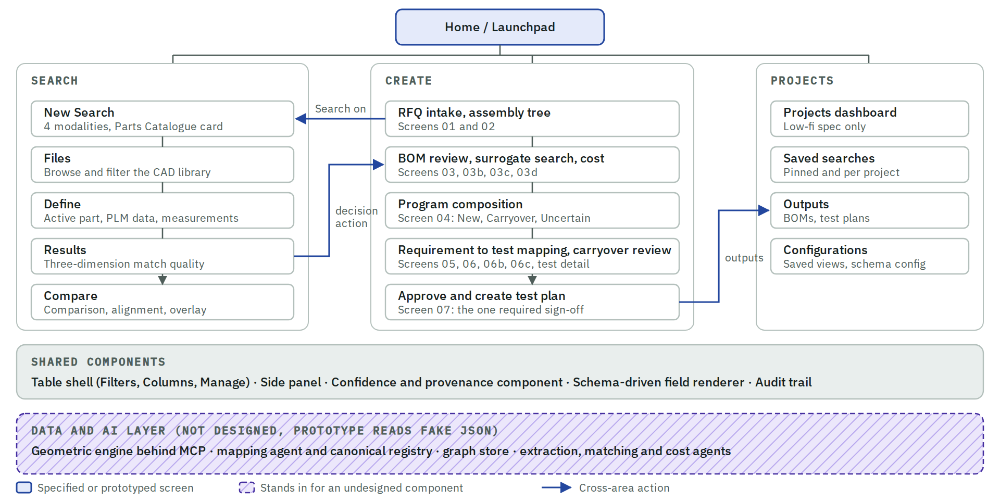
<figcaption>Search and Create connect in two ways. A decision action in Results or the Catalogue (for example Select as surrogate) hands a part back into the Create workflow the user came from. Search on opens a new search in a new browser tab for any part or assembly the user sees, so the workflow in progress is not disturbed. Save search and workflow outputs write to Projects.</figcaption>

</figure>

## Shared foundations

These pieces appear on more than one screen. Build each once and reuse it. Most of the inconsistency found in earlier prototypes came from restyling the same idea per screen.

### Chrome, navigation and feedback

The frame around every screen.
*\[Real app (beta): top nav only\]* *\[Design mock: left nav\]*

#### **Decided**

- Left navigation. **Search**: Assembly Search, Part Search, Find Duplicates, Find Revisions, Parts Catalogue. **Create** (renamed from Workflows, also the top-level tab label): BOM Creation, Warranty Analysis, Part Replacement. **My Projects**: a tree per project with Saved searches, Outputs and Configurations counts and a New project action. **Settings** in the footer.
- Top bar: logo as home link, optional tenant badge, Feedback button, help, notifications, user menu (initials, email, Settings, Log out).
- Breadcrumb strip under the top bar. Search uses `Search / Files / Define / Results / Compare`. The New Search step uses `Home / New Search`. Both are valid.
- Feedback modal: "Send feedback", field "What happened?", attachment dropzone, auto-attached context chips (user, page, build, theme), "Cancel" and "Submit ticket". Submitting creates a Jira ticket. This already works in the beta.
- Locked or upsell workflows and the "Found It" button are removed.

#### **Example**

- Tenant badge text ("Adient").
- Project names and the counts in the My Projects tree.
- The beta's two-tab top nav (Search, Saved Searches) is a beta limitation, not the target.

#### **Prototype simplification**

- Project tree contents and counts are static. Persistence and project membership are not designed \[BE\].
- Notifications have nothing behind them. "Owners notified" toasts are local state \[BE\].
**To reconcile:** the v2 consolidated brief describes a top nav plus breadcrumb strip with no second navigation sidebar. The search design files and Aaron's Oct 8 answers specify the left nav above. This document follows the left nav. The v2 prototype screens still render the older shell.

### Match quality: three separate dimensions

How the product says "how good, how sure, and what kind of data" without blending them into one number.
*\[Specified in search PRD\]* *\[Applies to Results, Compare, BOM, workflows\]*

#### Confidence

How sure the system is that this result is what the user is looking for, with the reasoning. Needs a "why" affordance that explains the number.

Treatment: numeric badge or word badge (High, Moderate, Low)

#### Similarity

How close the match is. The geometric score as a percentage with a progress bar. Banded for scanning.

Example bands: High ≥85, Medium ≥70, Low \<70

"Exact" is not a status. A 100% match is typed as a **geometric duplicate** (a different file whose geometry is 100% the same) or a **duplicate file**.

#### Data type or provenance

What kind of data this is. Shown as a chip beside the bar, never inside it.

Examples: Actual, Estimate, Surrogate, No match, Search failed

#### **Decided**

- The three dimensions are independent. A row can carry all three, any one, or none. "No match" and "Search failed" have no meaningful similarity percentage.
- One shared confidence and provenance component, reused on every screen. Earlier prototypes had five competing treatments (numeric badge, word badge, raw score pair, Moderate or Low column, greyed row).
- Filters support all three: similarity range, confidence level, data type.
- Two duplicate types sit at the top of the similarity scale. **Geometric duplicate**: a different file with 100% the same geometry. **Duplicate file**: the same file. There is no "Exact match" status. Where these two labels surface in the row (beside the bar, or in the data type chip) is not yet drawn.
- Color is always paired with a numeric or labeled readout. Never color alone.
- Computed values show a score and reasoning and look different from confirmed or user-supplied values (solid for computed, dashed for manual or user-supplied). Records a user adds are tagged "asserted, not computed" until a reviewer verifies them.
- **Review required** is a workflow approval status, not a fourth quality dimension. See the lifecycle below.

#### **Example**

- All band cutoffs (configurable).
- The list of data type values. The BOM screens currently use five: Actual (duplicate or quoted), Surrogate, Estimated, No match, Search failed. Treat these as the current example set for the data type dimension.
- Confidence wording and thresholds ("below the 60% threshold" appears in prototype screens, 55% in the dataset).

#### **Prototype simplification**

- Scores are pre-baked values from the example data. The matching engine and its reasoning output are not connected \[AI\].
- The shared component's payload is undefined. Every producer needs a uniform record: score or scores, type, evidence, last-verified state, confirmation state with actor and time \[BE\] \[FE\].
- Aggregation of the five similarity dimensions into one percentage has no stated weighting. In the dataset the match percent runs lower than the mean of the five \[AI\].

#### Review required lifecycle
System creates an output using an estimate or other unsure source→**Review required**→User approves the decision→**Confirmed** (label configurable)→Audit entry: time and who
The row then shows who confirmed it and when. The status names are examples. The audit trail itself has no design yet: the prototype fires a toast, with no user and timestamp record behind it.

### Table shell, side panel and drawer

One layout for every dense list: files, results, BOM lines, requirements, catalogue parts.
*\[Prototype v2\]* *\[Design mocks\]*

#### **Decided**

- Left sidebar with three tabs: **Filters**, **Columns**, **Manage** (saved views, row density, Save Current View).
- The right-hand side panel is the canonical detail view. The bottom drawer is reserved for chronological, scrubbable content (the carryover chain).
- Detail panel tabs for BOM and surrogate lines: **Summary / Similarity / Costing / PLM**. Requirements keep their own tab set.
- Hiding a column never touches Filters. Removing a column removes its filter unless another active filter depends on it.
- Row density: Compact, Default, Comfy. Files also offer a Gallery view.
- Filter control by data type: text gets a text search, five or fewer fixed options get multi-tag, six or more get multi-search, ordered categories get a segmented control, numbers get a dual-handle range, dates get presets plus custom range.
- Files table: 4 default columns, plus at most 3 columns that appear only when their filter is applied.

#### **Example**

- The filter groups (Program, Model Year, Release Status and so on) and every option count.
- Saved view names ("Costing review", "Sourcing risk", "Unresolved only", "Look twice", "Needs a test").
- Rows per page values (Compact 15, Default 10, Comfy 8).

#### **Prototype simplification**

- "Save Current View" only shows a toast. View persistence is not designed \[BE\].
- In the BOM table the Filters groups are three fixed groups, not generated from the column set, so the column-to-filter link is not wired \[FE\].
- The Released Date filter in the files mock does nothing. Build a real date-range control, do not copy the mock \[FE\].

### Schema-driven fields and configurable values

Statuses and fields differ per company and per data source. The UI must not hard-code them.
*\[Decided Oct 8\]*

#### **Decided**

- The PLM field schema is configurable. Every screen that shows or filters PLM metadata (Files filters, File Details, Define PLM tab, Results filters, columns and row tabs, Compare PLM tab, Catalogue facets) uses one schema-driven field renderer. Config supplies field key, label, type, control and grouping.
- A value-label lookup turns opaque IDs (for example `id1055`) into readable labels.
- Status vocabularies are fully configurable: Reuse Status, Release Status, Conformance State, certainty labels. Status tone (pass, info, warn, fail) is configurable too. The renderer shows whatever values it receives.
- Long term, an agent maps incoming source data into the canonical form. See the data layer section.

#### **Example**

- Three different PLM schemas were found in the sources: a full Adient-tenant set (Program Short Name, OEM Model Year, Customer Group Region, Product Line and more), a flat demo set, and a generic set (Program, Model Year, Calc Weight, Lifecycle State). None is final.
- Reuse Status sets: Preferred, Approved, Restricted, or Approved, Review, Obsolete.
- Conformance State values: Undetermined, Gap, Evaluated Elsewhere, No Gap, Not Applicable.
- Label differences such as "TDM" (the Adient label for the requirement table).

#### **Prototype simplification**

- The mapping agent, canonical schema and config store do not exist. The prototype is built against a prepared example dataset \[AI\] \[BE\].
- The config format (how a tenant declares fields and value labels) needs a spec before FE can build the renderer against it \[BE\] \[FE\].

### Row actions and decision actions

What a user can do with a part or assembly wherever it appears.
*\[Specified in search PRD\]*

#### **Decided**

- **Compare** opens the Compare screen.
- **PLM link** is rendered but disabled with a "coming soon" tooltip. Same for Open in PLM everywhere.
- **Search on** starts a new search for the part or assembly the action sits on, in a new tab, with that part as the active part in Define. Available wherever a part or assembly appears: results rows, catalogue rows and compare, workflow screens.
- **Decision actions** appear when a part is reached from inside a workflow, so the user can choose this part over that one. Examples: Select as surrogate, Select as replacement part, Add to assembly. The workflow context supplies the label and the effect. They are configured per workflow context, not hard-coded.
- With no workflow context (plain catalogue browsing) no decision action is shown.

#### **Example**

- Button labels. "Use This Part" in the catalogue is a placeholder name.
- The toast "{pn} added to Seat Track Bracket · Rev C" in the catalogue prototype. Do not hard-code that destination.

#### **Prototype simplification**

- Workflow context passing (which workflow, which line, what the action writes back) is not designed \[FE\] \[BE\].
- Open in PLM, Save View and Export CSV are toasts or inert \[BE\].
- Preview and an overflow "More" menu in the mock are not part of the spec.

## Home and projects dashboard

### Home / Launchpad

Where a user starts: search, run a workflow, or pick up saved work.
*\[Design mock (Canvas.dc.html)\]*

#### **Decided**

- Hero search bar with ⌘K, placeholder "Describe a part, paste a spec, or search saved work…".
- Three quick actions: Start a Search, Run a Workflow, Saved Searches (pinned searches or an empty state that prompts to pin one).
- "Recent (this session)" strip: each item shows requirement or datum count, result count and a pass, warn or fail pill, with a link to My Projects.
- The richer two-row chrome in Canvas.dc.html is the most current. The plainer Home.html and early Wireframes.html disagree with it.

#### **Example**

- Accepted formats shown on the Start a Search card. The home card says STEP, SLDPRT, IGES, PRT while New Search says CATPart, CATProduct, STEP, SolidWorks. Pick one example list and use it everywhere.
- The Adient-tenant recent-searches data.
- Workflow count on the Run a Workflow card.

#### **Prototype simplification**

- Recent and pinned items come from static data. Real session history and pinning need an activity log \[BE\].
- Natural-language search over "parts, specs and saved work" has no backend \[AI\].

### Projects dashboard (Project overview and Output overview)

One dashboard shell with two scopes. Content changes with scope, layout does not. It answers three questions: what is high priority or near a deadline, what is connected and how, and where things stand and what is next.
*\[Low-fi brief\]* *\[Not built in v2\]*
<figure class="diagram" style="margin-top:0">
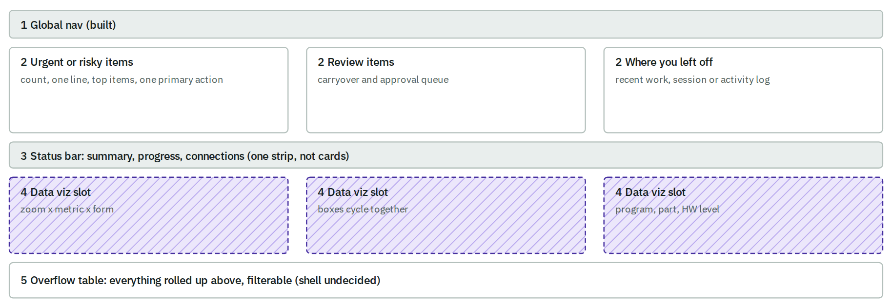
<figcaption>Dashboard bands from the low-fi brief. Hatched bands depend on services that are not designed: aggregation across program, part and hardware level, certainty, price, diversity and timeline.</figcaption>

</figure>

#### **Decided**

- Five bands in the order shown. One shell, two scopes. Reusable later for price or supplier and validation-approval dashboards.
- Action boxes reuse the Program composition box pattern: count, one line, top-items list, one primary action.
- Action rows need due date, downstream impact, severity and owner.
- Dashboards, not extra nav, are the intended orientation for the Create workflows.

#### **Example**

- Zoom levels (program, part, HW level), metrics (certainty, price, diversity and redundancy, timeline) and forms (graph, chart, table, action items). Variants should show two or three combinations.
- Severity values Critical, High, Medium, Low and owner names shipped in the example dataset.

#### **Prototype simplification**

- Not built. The prototype opens on RFQ intake. Empty, loading, error and partial-connection states are not specified, so do not invent them.
- Activity log, aggregation service, connection-health service and deadline tracking are all undesigned \[BE\].
- Severity has no source yet (reuse the DFMEA scale or define one). Owner appears only on the final Approve screen.
- Downstream impact depends on the impact map, which is itself a prototype of a graph service \[BE\].

## 3D CAD search

Engineers find geometrically similar parts or assemblies across the company's CAD and PLM library, compare a candidate against a reference part in 3D, and confirm or reject the match. The proprietary matching engine sits behind this feature and is out of scope for UI work. The target front end is specified in full. The production app today is a very limited beta, so the snapshots below mix real beta frames and design references. Each caption says which.

<figure class="diagram">
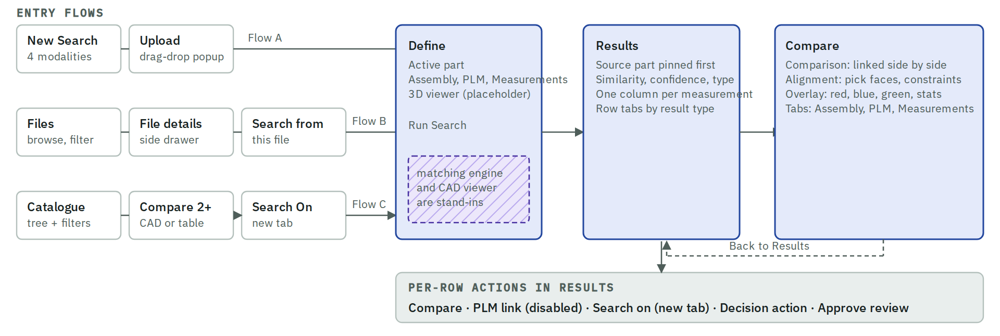
<figcaption>Flow A and Flow B are both valid and share the Define, Results and Compare screens. Flow C starts in the Parts Catalogue and reaches the same Define screen through Search On. Define is shared infrastructure.</figcaption>

</figure>

### New Search: four modalities, one catalogue entry

The fully built entry screen. Pick what you are searching with and what you want back, then upload.
*\[Design mock plus real screenshot\]*
<table>
<colgroup>
<col style="width: 25%" />
<col style="width: 25%" />
<col style="width: 25%" />
<col style="width: 25%" />
</colgroup>
<thead>
<tr class="header">
<th>Name (recommended)</th>
<th>You give</th>
<th>You get</th>
<th>Card copy</th>
</tr>
</thead>
<tbody>
<tr class="odd">
<td><strong>Find similar parts</strong> 
Part → Part</td>
<td>A single part</td>
<td>Individual parts with similar geometry, no assemblies</td>
<td>"Upload a part. Get back individual parts with similar geometry. No assemblies."</td>
</tr>
<tr class="even">
<td><strong>Find assemblies that use this part</strong> 
Part → Assembly</td>
<td>A single part</td>
<td>Assemblies that contain a similar part</td>
<td>"Upload a part. Get back assemblies that contain similar parts as a sub-component."</td>
</tr>
<tr class="odd">
<td><strong>Find similar assemblies</strong> 
Assembly → Assembly</td>
<td>A whole assembly</td>
<td>Assemblies with similar structure and matching children</td>
<td>"Upload an assembly. Get back assemblies with similar structure and matching child parts."</td>
</tr>
<tr class="even">
<td><strong>Pull matching parts out of assemblies</strong> 
Part-in-Assembly → Part</td>
<td>A part, in the context of its assembly</td>
<td>Matching parts elsewhere, tagged with parent assembly</td>
<td>"Upload a part within an assembly. Get back the matching parts, tagged with their parent assembly."</td>
</tr>
</tbody>
</table>
<figure>
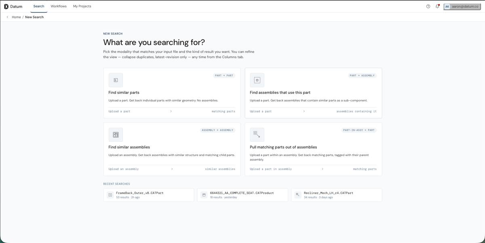
<figcaption><em>[Real app screenshot]</em> New Search: four modality cards and recent searches. The Parts Catalogue card sits beside these in the target design.</figcaption>

</figure>

#### **Decided**

- Exactly four modalities, selected before upload. The Parts Catalogue is a fifth search entry (nav item and card), not a fifth modality.
- Upload is a popup with drag-and-drop or a file selector. The Teamcenter-ID paste option is dropped.
- In Flow B the modality is implied by the node chosen in the Define assembly tree: a leaf part gives part-to-part or part-in-assembly, the assembly root gives assembly-to-assembly.
- Names: use one scheme. The recommendation is the homepage card copy because users see it first.

#### **Example**

- Accepted file types (CATPart, CATProduct, STEP, SolidWorks). The real list is not fixed.
- Recent-search rows.

#### **Prototype simplification**

- In the design mock the card click is a no-op, and the upload step and its link into Define are not specified in the supplied files. The popup needs to be designed \[FE\].
- File parsing and geometry upload processing have no backend \[BE\].

### Files: browse and filter the CAD library

Find an existing file, inspect it, and start a search from it.
*\[Real app (beta recording)\]* *\[Design mock for richer filters\]*
<figure>
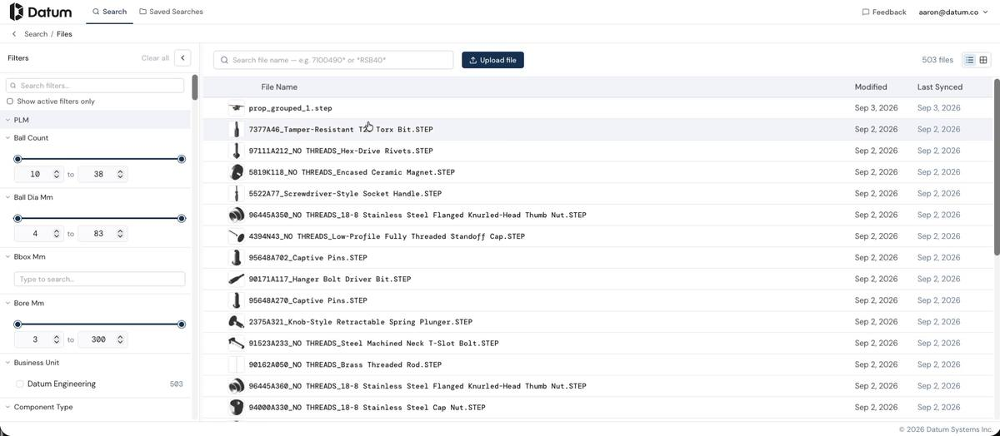
<figcaption><em>[Real app]</em> Files list with the PLM filter sidebar.</figcaption>

</figure>

<figure>
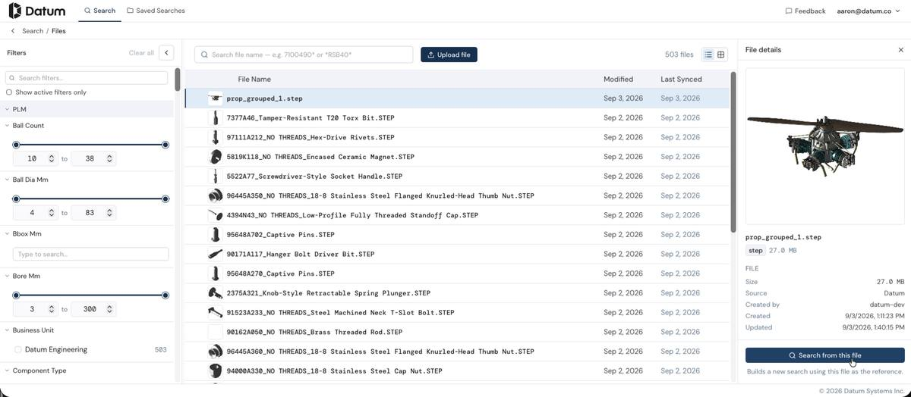
<figcaption><em>[Real app]</em> File Details drawer with "Search from this file".</figcaption>

</figure>

#### **Decided**

- Top bar: search box (case-insensitive, `*` wildcard), Upload file, count, list or grid toggle.
- Left filter sidebar by category, each group collapsible. Numeric attributes use dual-handle sliders with min and max inputs. Categorical filters are checkbox lists with live counts. Release Status and similar PLM fields in the target set.
- Default columns: thumbnail, File Name, Modified, Last Synced. Up to 3 more appear when their filter is applied. Overflow filters remain in the detail panel.
- Sort by Date modified (default), File name, Released date or Calc weight, ascending or descending.
- File Details drawer shows a large thumbnail, type and size, file section, and every PLM field regardless of active filters. Primary action "Search from this file" with the helper text "Builds a new \[requirement\] search using this file as the reference."
- Empty states: "No files match the current filters and search." and "No filters match "{query}"."

#### **Example**

- Domain attributes in the beta (Ball Count, Ball Dia Mm, Bore Mm).
- The automotive filter set: Program, Model Year, Program Type, Customer Group, Region, Product Group, Product Line, Calc Weight, Release Status, Lifecycle State, Released Date.
- All counts and file names.

#### **Prototype simplification**

- The library index and PLM sync are not designed. "Last Synced" implies a connector \[BE\].
- Thumbnails need a render service for real CAD \[BE\].
- Released Date filter is non-functional in the mock \[FE\].

### Define: set up the search

Pick the active part, review its PLM data, and capture measurements that become search constraints.
*\[Real app (beta recording)\]*
<figure>
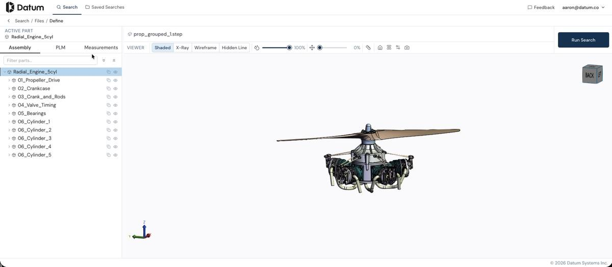
<figcaption><em>[Real app]</em> Assembly tab: part tree and 3D viewer.</figcaption>

</figure>

<figure>
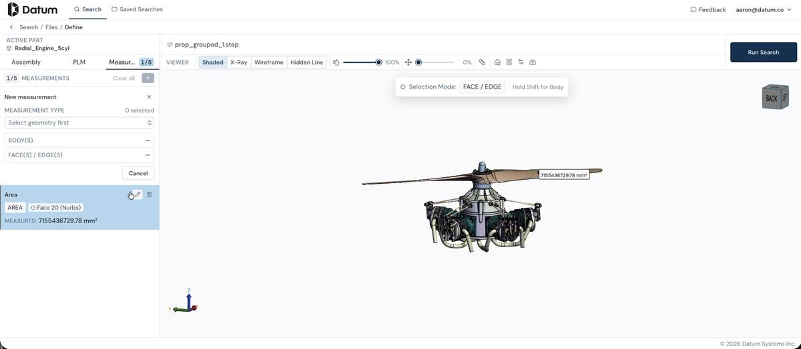
<figcaption><em>[Real app]</em> Measurements tab with a captured Area measurement.</figcaption>

</figure>

#### **Decided**

- Left panel: an ACTIVE PART header and three tabs. **Assembly** is the full tree, and selecting a node sets the active part. **PLM** is read-only metadata. **Measurements** captures up to 5 geometric measurements.
- Measurement flow: select a face or edge (Shift for a whole body) in the viewer, then choose a type per selected geometry. The type list is data-driven.
- Each captured measurement is both a search constraint and a column in Results.
- Viewer controls: Shaded, X-Ray, Wireframe, Hidden Line, zoom, pan and orbit, opacity, measure, reset, visibility, snapshot. View cube top right, axis gizmo bottom left.
- Primary action top right: **Run Search**.

#### **Example**

- Measurement types: area, perimeter, height, diameter, length. More exist than the video shows.
- PLM field list (Name, Site, CRM ID, Bbox mm, Item ID and so on). It is configurable.

#### **Prototype simplification**

- **No real CAD viewer.** Every 3D viewport is a placeholder and its controls are visual only \[FE\].
- "Select geometry in the viewer" is simulated, for example by picking from a list or clicking a placeholder \[FE\].
- Measurement extraction from real geometry is part of the engine boundary \[AI\].

### Results

Ranked matches with a pinned source row, filterable on all three quality dimensions.
*\[Real app (beta recording)\]* *\[Real screenshot (Adient tenant)\]*
<figure>
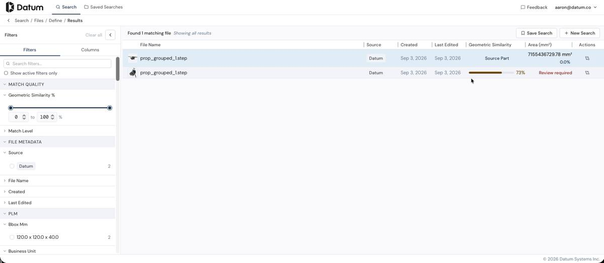
<figcaption><em>[Real app]</em> Results table. The source part is pinned first. "Review required" next to 73% is the workflow status described under shared foundations.</figcaption>

</figure>

<figure>
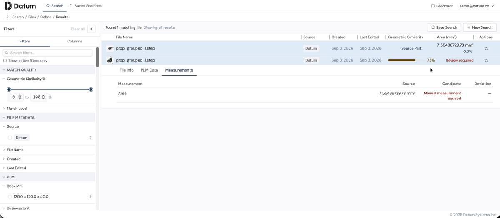
<figcaption><em>[Real app]</em> Expanded row, Measurements tab. "Manual measurement required" appears when the candidate value cannot be derived.</figcaption>

</figure>

<figure>
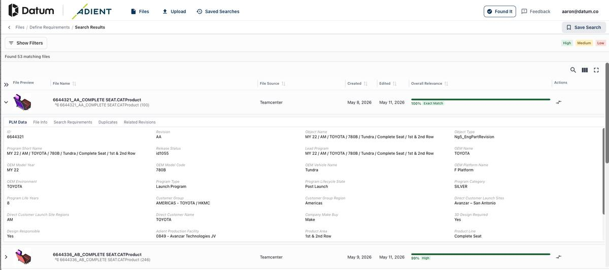
<figcaption><em>[Real screenshot]</em> Assembly-level results in the Adient tenant. The screenshot labels a 100% row "Exact Match"; that label is dropped, see geometric duplicate and duplicate file under shared foundations. the High band, PLM Data panel, and the assembly-level tab set.</figcaption>

</figure>

#### **Decided**

- Header "Found {N} matching file(s)" with Save Search and + New Search.
- Sidebar tabs Filters (Match Quality, File Metadata, PLM) and Columns.
- Columns: File Name, Source, Created, Last Edited, Geometric Similarity (bar, percent, label), one column per captured measurement, Actions. The query file is pinned first, labeled **Source Part** at 0%.
- Three-dimension match quality with the shared component (see shared foundations).
- Row expansion tabs depend on result type. Part-level: File Info, PLM Data, Measurements. Assembly-level: PLM Data, File Info, Search Requirements, Duplicates, Related Revisions. Modality-conditional extras: Contained Parts (N), Assemblies (N) or In Assembly, Sibling Parts.
- Measurements tab columns: Measurement, Source, Candidate, Deviation. When the candidate value cannot be derived, show "Manual measurement required" in red and "–" for deviation. Engineering must support this state.
- Row actions, Review required approval, and audit entry as described in shared foundations.

#### **Example**

- Similarity band labels (High, Medium, Low) and their cutoffs. "Exact Match" in the mock and the Adient screenshot is not a status. Use geometric duplicate or duplicate file.
- The extra measurement columns in the mock (Piston Head Area, Piston Height, Pinhole Diameter, Rod Length), each with a tolerance mini-bar. The mechanism generalizes to any number of captured dimensions.
- All file names, programs and PLM values.

#### **Prototype simplification**

- The matching engine behind the scores, and the auto-derivation of candidate measurements \[AI\].
- Child-part match percentages in the mock are derived from the parent's score as fixture logic. Do not treat that as the algorithm \[AI\].
- An assembly's header count and its Contained Parts caption disagree in the mock (for example 246 against "9 of 12"). Reconcile against one source \[FE\].
- The Result scope control (Parts, Assemblies, Both) is cosmetic in the mock \[FE\].
- Action copy differs between tabs ("Search on this assembly" against "Run search on this revision"). Pick one phrase per action \[FE\].

### Compare (model comparison)

Look at a reference and a candidate side by side, align them, and see overlap numerically.
*\[Real app: comparison, alignment and overlay states\]*
<figure>
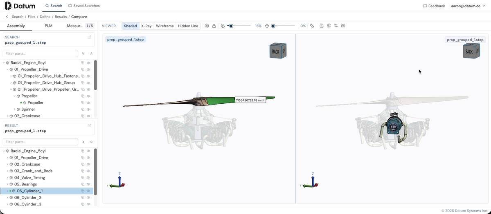
<figcaption><em>[Real app]</em> Comparison state: linked side-by-side viewports and assembly trees.</figcaption>

</figure>

<figure>
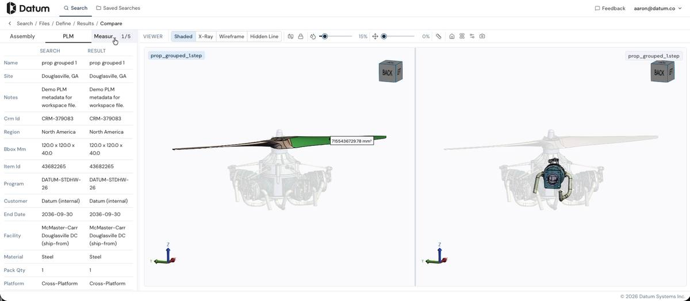
<figcaption><em>[Real app]</em> PLM tab: field-by-field comparison.</figcaption>

</figure>

<figure>
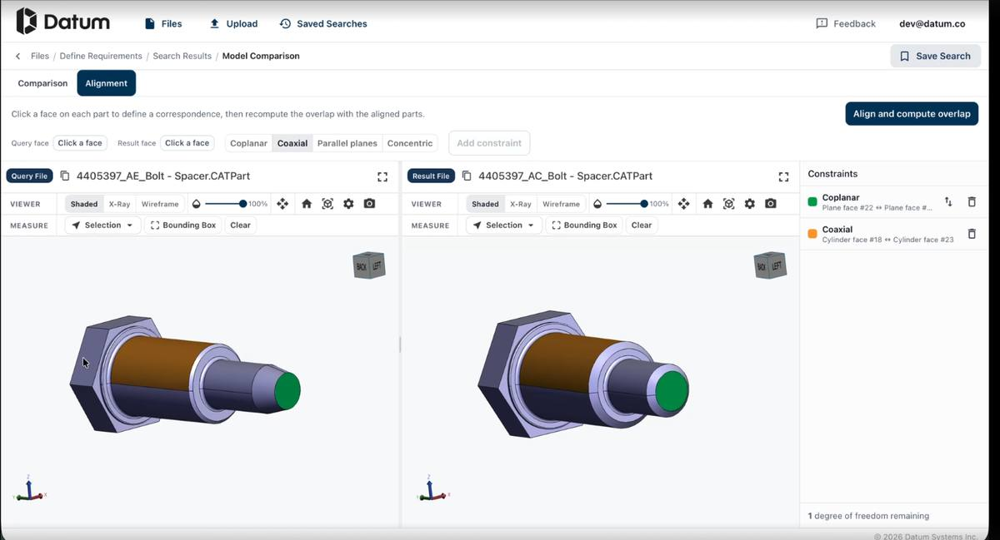
<figcaption><em>[Real app screenshot]</em> Alignment state: constraint chooser and constraints list with the degrees-of-freedom readout.</figcaption>

</figure>

<figure>
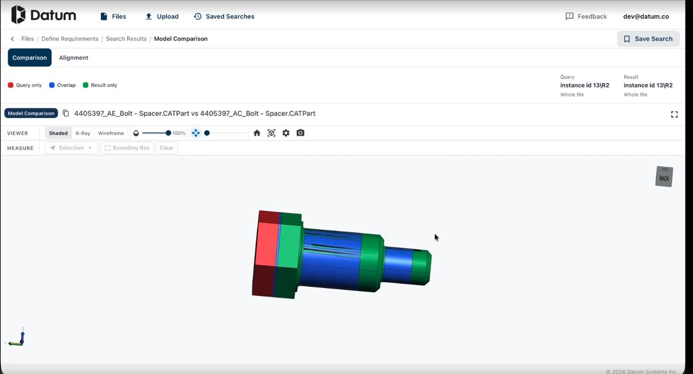
<figcaption><em>[Real app screenshot]</em> Overlay: red query only, blue overlap, green result only.</figcaption>

</figure>

#### **Decided**

- Sidebar tabs Assembly, PLM, Measurements, each mirrored for Search part and Result part. Matching PLM values get a positive-confirmation highlight.
- Three viewer states. **Comparison**: two camera-linked viewports. **Alignment**: pick a face on each part, the system infers a constraint (Coplanar, Coaxial, Concentric, Parallel planes), a counter shows degrees of freedom remaining from 6, and "Align and compute overlap" continues. **Overlay**: one blended viewport (Query only red, Overlap blue, Result only green) with volumes, a per-axis Δ bounding box and summary stats (Volume match %, Max deviation, Aligned by N constraints). Overlay is reached only through "Align and compute overlap".
- View modes: Shaded, X-Ray, Wireframe, Hidden Line (the three-mode list in the mock is superseded). Plus zoom, measure tools (Selection, Bounding Box, Clear), reset, fit, snapshot.
- Each viewport has a chip ("Query · {filename}", "Result · {filename}"), a view cube and an axis gizmo.
- Color is always paired with a labeled numeric readout.
- Comparison is always one part against one part in CAD. Multi-part comparison is a table on text and numeric attributes (see catalogue).

#### **Example**

- All overlay stats, deltas and constraint lists.
- The PLM fields compared.

#### **Prototype simplification**

- **No CAD viewer.** The alignment solver, overlap volume and deviation are all placeholders \[AI\] \[FE\].
- Constraint inference is a placeholder. A planar face paired with a cylindrical face falls through to "Parallel planes", which is not meaningful. Either design real inference or let the user choose the type \[AI\].
- "Align and compute overlap" is never gated by the DOF counter. Decide whether under-constrained alignment is blocked or only warned \[FE\].
- "Aligned by N constraints" is a literal in the mock \[FE\].

## Parts Catalogue

Browse what the company already has by category and spec, with no CAD upload. Modeled on the McMaster-Carr catalogue. This is a conceptual first version, not final. The interactive Bolt Finder is the behavioral reference. The static canvas of eleven options is the layout rationale.

### Landing, drill-down and results

Find a part by category tree and filters. Filters narrow the tree.
*\[Concept v1 (Parts Catalogue.dc.html artboards)\]*
<figure>
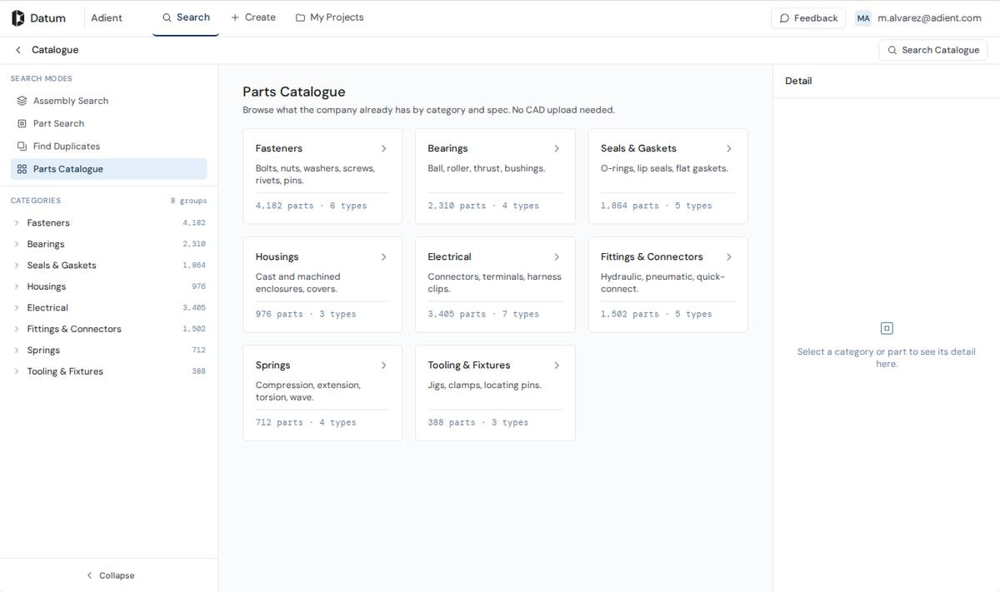
<figcaption><em>[Concept]</em> Landing: search, recent chips, category tiles.</figcaption>

</figure>

<figure>
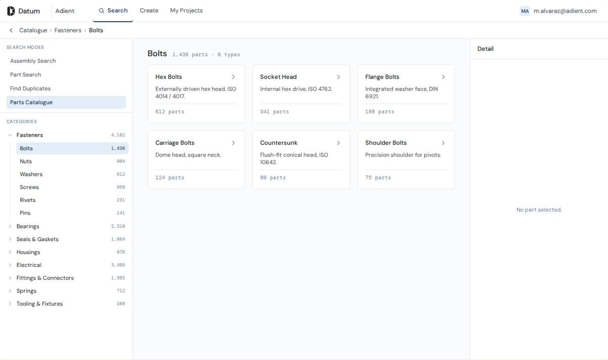
<figcaption><em>[Concept]</em> Fasteners to Bolts: type cards.</figcaption>

</figure>

<figure>
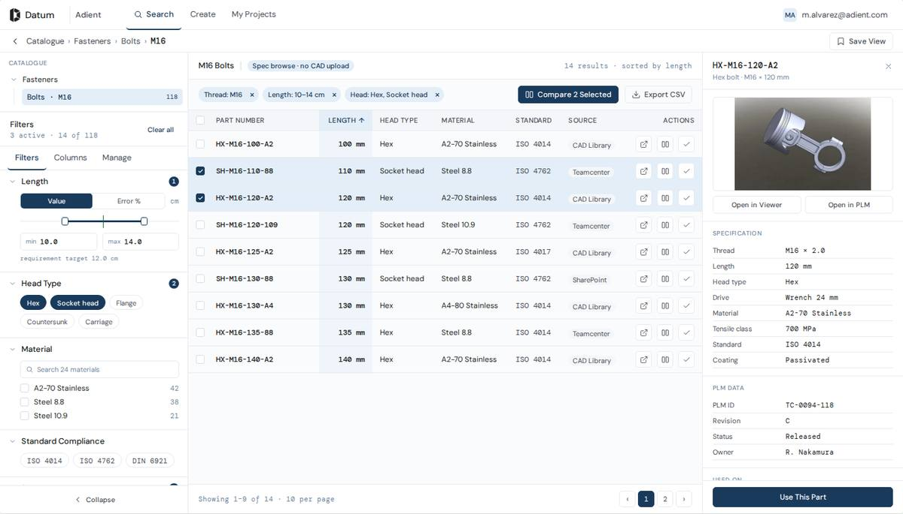
<figcaption><em>[Concept]</em> Results table, filters, part drawer.</figcaption>

</figure>

#### **Decided**

- Flow: landing, category, type, narrow by spec, results table, select two or more and compare, decision action.
- Users find parts by both the category tree and the filters. Active filters make the tree respond: node counts update and nodes with no matching parts are dimmed or hidden. Selecting a tree node scopes the filters and results. Breadcrumbs mirror the tree path, for example `Search › Catalogue › Fasteners › Bolts › M16 › Compare`. Back restores the previous filter state.
- Layout: left rail with the pinned category tree and the shared filter sidebar. Right panel is "empty, never gone" until a part is selected.
- Results table appears as soon as any filter is active. Clearing all filters returns to tiles. Header "{title} · {n} results · sorted by {column}", removable filter pills, Compare, Export CSV, Save View, sortable headers, pagination, an empty state with Clear All Filters.
- Part detail drawer: spec section, PLM Data section, optional Used On list, Open in Viewer, Open in PLM (disabled), Add to Compare, and the decision action when a workflow context exists.
- Search On on each part in the table, drawer and compare views.
- Facet semantics: multi-select within a facet is OR, facets combine with AND. Each option's count is computed with all other facets applied. Options with zero results are disabled unless already active. Compatibility rules emerge from the data. Clear works at three levels: section, group, global.
- Each category node declares 0 to 3 quick-select axes as chips. Free text parses a spec query into facets ("M16 hex stainless" becomes thread M16, head Hex, both stainless grades).

#### **Example**

- Eight categories (Fasteners, Bearings, Seals and Gaskets, Housings, Electrical, Fittings and Connectors, Springs, Tooling and Fixtures) and all counts.
- Facets: Thread Size, Length, Head Type, Grade, Material, Standard Compliance, Reuse Status, Source, Program Usage.
- Reuse Status values: Preferred, Approved, Restricted (interactive file) or Approved, Review, Obsolete (static file). Fully configurable, including tone.
- Part numbers, "Used On" entries such as "T3 Heat Exchanger, 14 uses", the "requirement target 12.0 cm" marker on the Length slider (a hook for seeding from a project requirement, not required for v1).

#### **Prototype simplification**

- Only Fasteners and Bolts carry real data. Other tiles toast "opens the same browse flow" \[BE\].
- Catalogue source (CAD Library, Teamcenter, SharePoint) and facet generation from real PLM schemas are undesigned \[BE\] \[AI\].
- Save View, Export CSV and Open in PLM are toasts or disabled \[BE\].
- Known mock bugs, not to copy: selected rows still arm Compare after filters hide them, Back does not restore selection or sort, "N of 15 fields differ" counts administrative fields (Source, PLM ID, Revision, Status), no guard for fewer than two parts, Columns and Manage tabs and Collapse do nothing in both files, "10 per page" shows 9 rows, unit mix of cm and mm.

### Compare catalogue parts: two forms

Look at two parts in CAD, or many parts in a table.
*\[Concept v1\]*
<figure>
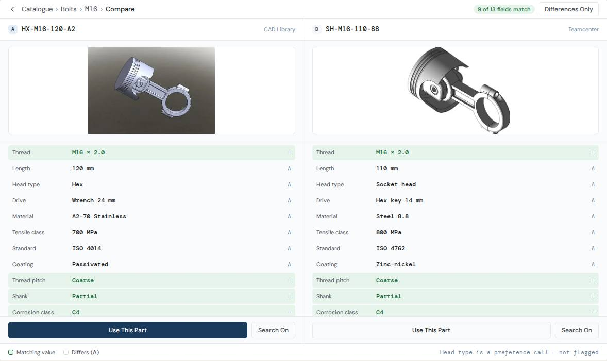
<figcaption><em>[Concept]</em> A-to-B comparison with field-match highlighting.</figcaption>

</figure>

<figure>
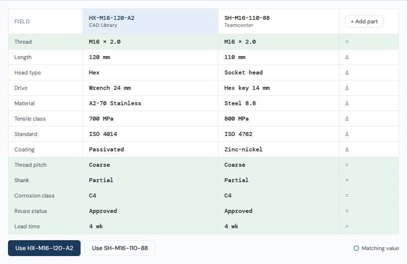
<figcaption><em>[Concept]</em> Aligned attribute table with "Add part" column.</figcaption>

</figure>

#### **Decided**

- **A-to-B CAD comparison:** exactly two parts in the dual-pane CAD viewer. This is how CAD comparison works today: one part against one part.
- **Multi-part attribute comparison:** two or more parts in a table, text and numeric attributes only. Columns Field, Part A, Part B, then a dashed "+ Add part" column. Each row carries "=" (match, green) or "Δ" (differs). An "All Fields / Differences Only" toggle and a count of differing fields. Decision action and Open in PLM per part. The "3 to 4 parts" note is guidance, not a cap.

#### **Example**

- The two example parts (HX-M16-120-A2 and SH-M16-110-88) and all field values.
- The "9 of 13 fields match" pill in the static file contradicts its own data (6 match, 7 differ). Ignore it.

#### **Prototype simplification**

- The dual-pane CAD viewer is the same placeholder as in search compare \[FE\].
- Which fields are administrative and excluded from the difference count is undecided \[FE\].

## BOM and cost

The Create workflow turns an RFQ package into a costed BOM and, through the requirements screens in the next section, an approved test plan. The prototype walks one example RFQ (a Turbocharger Module) through seven steps. The screens below are the first four steps plus their sub-screens. The state of every step is held in memory in the prototype.

<figure class="diagram">
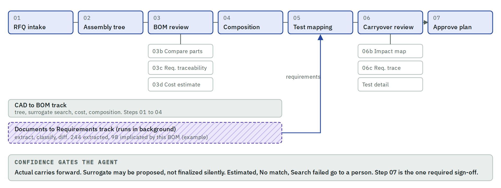
<figcaption>Composition sorts BOM lines into New, Carryover and Uncertain. New goes to Test mapping, Carryover and Uncertain go to Carryover review ("Resolve Evidence" jumps straight to the evidence surface). The documents track runs while the user works the BOM, and its output meets the BOM at step 05.</figcaption>

</figure>

### 01 RFQ intake

Show the RFQ package arriving and splitting into a CAD to BOM track and a Documents to Requirements track.
*\[Prototype v2\]*
<figure>
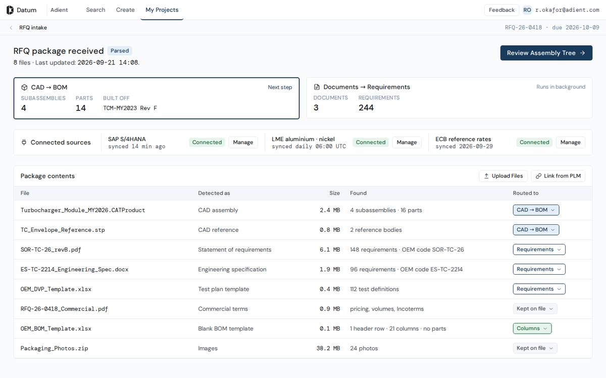
<figcaption><em>[Prototype v2]</em> Package received, two tracks, connected sources, package contents.</figcaption>

</figure>

#### **Decided**

- One package, two tracks. Track cards: "CAD → BOM · Next step" and "Documents → Requirements · Runs in background". Primary action "Review Assembly Tree".
- Package contents table (File, Detected as, Size, Found, Routed to) with Upload Files and Link from PLM. Clicking a Routed-to pill cycles CAD → BOM, Requirements, Columns, Kept on file, and the track counts recompute.
- The **Columns** route is for a detected blank or example BOM. Parsed template columns split three ways, matching the BOM tiers: Matched, To confirm, Custom.
- Connected sources block (cost data, commodity, FX) shown as already on. Disconnecting changes BOM behavior downstream: quote sources relabel to "Cached quote" and the cost-risk band widens.
- The stepper is clickable and its sub-labels recompute when the user revisits a step.

#### **Example**

- The 8 files: a CAD assembly (4 subassemblies, 16 parts), a reference STEP, SOR-TC-26 (148 requirements), ES-TC-2214 (96), a DVP template (112 test definitions), a commercial PDF, a BOM template (21 columns), photos.
- Sources: SAP S/4HANA, LME aluminium and nickel, ECB reference rates, with sync times.
- "BUILT OFF TCM-MY2023 Rev F".

#### **Prototype simplification**

- File detection, routing, OEM-code detection and requirement counts are static. Document ingestion and requirement extraction do not exist \[AI\].
- The CAD assembly parser is faked ("4 subassemblies · 16 parts" is hard-coded) \[BE\].
- Template column mapping (21 = 13 matched + 5 to confirm + 3 custom) uses constant lists \[AI\].
- SAP, LME, ECB and PLM connectors are toggles. Sync times are strings. Upload and Link only toast \[BE\].
- Probable off-by-one: the blank-BOM template route points at the wrong file index, so template-column matching likely never activates \[FE\].

### 02 Assembly tree

Choose which parsed CAD parts become blank BOM lines.
*\[Prototype v2\]*
<figure>
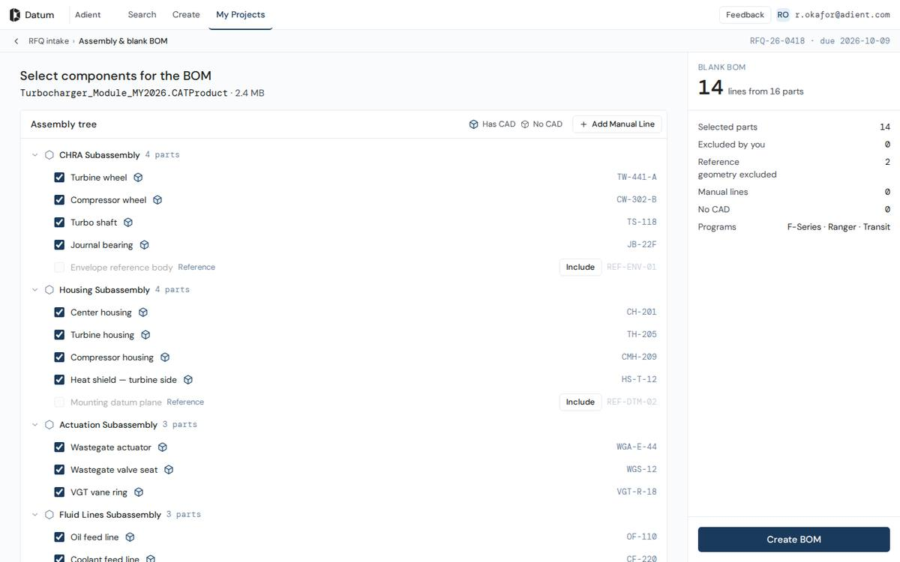
<figcaption><em>[Prototype v2]</em> Tree grouped by subassembly, include checkboxes, Has CAD and No CAD legend, Create BOM.</figcaption>

</figure>

#### **Decided**

- Tree grouped by subassembly with a per-part include checkbox. Reference-geometry parts are excluded automatically and can be included. "Add Manual Line" adds a Manual part.
- CAD status is binary: Has CAD or No CAD. No CAD caps certainty at Estimated. The indicator is an icon with an upload action, not a column.
- Uploading CAD on a No-CAD line flips it to Has CAD ("CAD attached" toast). Sub-labels update ("14 of 16 parts selected").
- Footer: "N lines from M parts", summary of Selected, Excluded by you, Reference excluded, Manual, No CAD, and Create BOM.
- The empty state "CAD part not rendered" is shared with the compare screen.

#### **Example**

- CHRA, Housing, Actuation, Fluid Lines groups. Parts such as BRC-07 (manual, qty 2), REF-ENV-01 and REF-DTM-02 (reference bodies).

#### **Prototype simplification**

- The assembly-to-BOM builder is faked: the tree, the 16-part count and the 14-line default are static \[BE\].
- Each No-CAD part has a canned result before and after CAD upload (for BRC-07, Estimated 55% becomes Surrogate 86% matched to BRC-04). Upload only swaps results \[AI\].

### 03 BOM review

Run surrogate search over the blank BOM, review certainty and cost, and drill into any line.
*\[Prototype v2\]*
<figure>
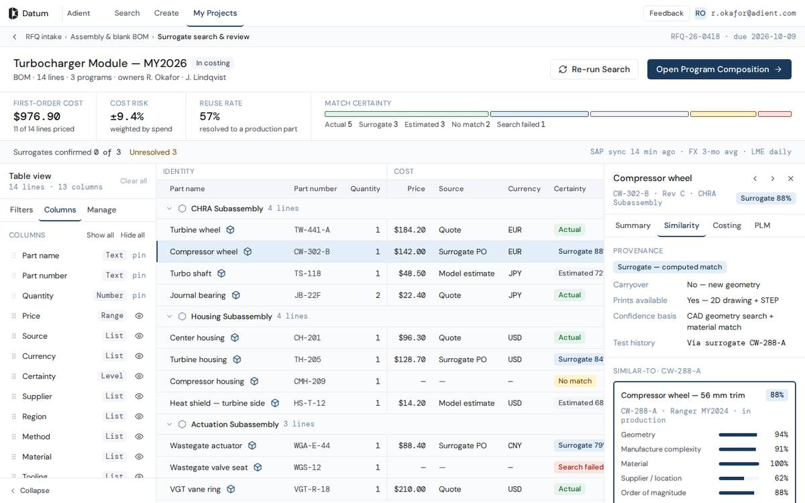
<figcaption><em>[Prototype v2]</em> After Run Surrogate Search: KPI strip, certainty bar, grouped table, column manager, detail panel on Similarity.</figcaption>

</figure>

#### **Decided**

- KPI strip: first-order cost ("N of M lines priced"), cost risk, reuse rate, and a stacked match-certainty bar. Counters for Surrogates confirmed and Unresolved. A pre-search banner with Run Surrogate Search.
- Table grouped into collapsible subassembly folders. Skeleton cells while searching.
- Canonical columns. Always on: Part name (pinned), Part number, Quantity. Cost: Price, Source, Currency, Certainty. Sourcing: Supplier, Region, Method. Manufacture: Material, Tooling, Cx. An "Additional" group is hidden by default (Lead time, Model year, Tooling faces, Weight, Volume, Program MY).
- Roll-ups: total = sum of price × quantity over priced lines. Reuse rate = (Actual + Surrogate) over all lines.
- Detail panel tabs: **Summary** (assembly, lineage, program usage, linked requirements, physical match), **Similarity**, **Costing**, **PLM**.
- **Similarity by state.** Actual: provenance "Carryover — geometric duplicate", directly replaceable. Surrogate: a Similar-to card with match percent, a five-part breakdown (Geometry, Manufacture complexity, Material, Supplier / location, Order of magnitude), Compare parts, PLM record, **Accept as surrogate** (becomes Confirmed surrogate) and other candidates. Estimated: "Estimated — cost model" with Request quote. No match or Failed: "Loosen the search" controls, Re-run, Edit parameters and **Match manually** (tagged Provenance: manual, no computed score).
- **Costing**: price, range, confidence with decay, where it is made, uncertainty drivers, sourcing options.
- Geometric similarity is one input to surrogacy, not a tier. A **duplicate** is stricter: identical geometry and material, differing only in PLM metadata.

#### **Example**

- The 14 lines (Actual 5, Surrogate 3, Estimated 3, No match 2, Search failed 1), \$976.90 over 11 priced lines, cost risk ±9.4%, reuse 57%.
- Saved views "Costing review", "Sourcing risk", "Unresolved only".
- Uncertainty drivers: FX ±4.1%, price source ±1.9%, tariff ±2.4%, material index ±2.0%.
- "Loosen the search" values (similarity floor 60% to 45%).

#### **Prototype simplification**

- The surrogate search is a 1.4 second timer. All match percents, candidate lists and provenance fields are hard-coded. The five similarity values are the same constants for every line (94, 91, 100, 62, 88) \[AI\].
- Price ranges, Cx, Tooling, Lead time and Currency are fabricated by lookup \[BE\].
- Cost risk ±9.4% is a constant. The four listed drivers sum to 10.4%, so the roll-up is unspecified. Confidence decay "12% since 2026-06" is a literal \[AI\].
- Request quote, Edit parameters, Re-run are not wired \[BE\].
- The "of 3 surrogates confirmed" step label is hard-coded \[FE\].

#### Certainty tiers used in the BOM screens
| Tier (UI label)   | Meaning                                                                                      | Dataset value                     | Notes                                                                               |
|-------------------|----------------------------------------------------------------------------------------------|-----------------------------------|-------------------------------------------------------------------------------------|
| **Actual**        | Geometric duplicate of a production part (different file, 100% the same geometry), or quoted | `Actual`, `match_type: duplicate` | No percent shown in the prototype. Whether a duplicate needs its own badge is open. |
| **Surrogate**     | Best computed match to a production part. Not a replacement.                                 | `Surrogate`                       | Percent is the match score. Example range 58 to 95.                                 |
| **Estimated**     | Weak or no usable match, or no CAD. Priced from a cost model.                                | `Estimated`                       | Percent is model confidence, a different quantity from the surrogate percent.       |
| **No match**      | Nothing above threshold                                                                      | `No match`, `match_type: new`     | The prototype shows no price. The dataset prices it.                                |
| **Search failed** | Process failure, for example an unreadable part body                                         | No data record                    | A system state, not a sourcing conclusion. Show a retry affordance.                 |

### 03b Compare parts

Compare a BOM line against its closest production part, with the requirements that drive the choice.
*\[Prototype v2\]*
<figure>
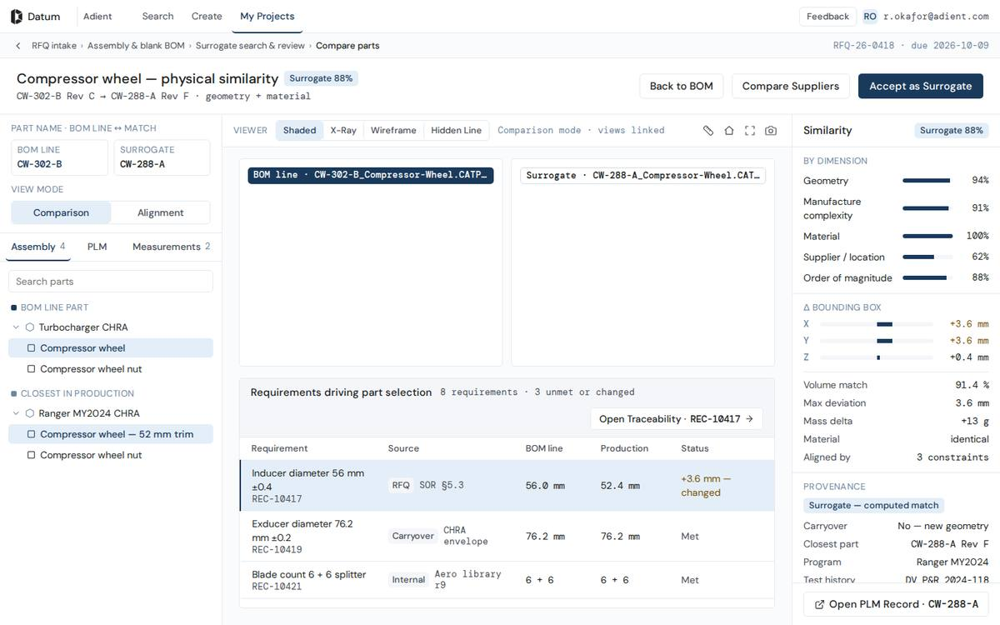
<figcaption><em>[Prototype v2]</em> Compressor wheel CW-302-B against CW-288-A. The 3D panes are blank because the prototype has no model.</figcaption>

</figure>

#### **Decided**

- Title "{part} — physical similarity" with a tier badge. Left tree, Assembly / PLM / Measurements tabs. Viewer in Comparison mode and Alignment mode ("Aligned · best fit from 3 constraints"), same view modes as search compare.
- Right panel: similarity breakdown by dimension, volume overlap, Δ bounding box, max deviation, mass delta, material, provenance "Surrogate — computed match", Open PLM Record.
- Bottom table "Requirements driving part selection": Requirement, Source, BOM line value, Production value, Status. Selecting a row feeds 03c.
- Actions: Back to BOM, Compare Suppliers, Accept as Surrogate.

#### **Example**

- Volume overlap 94.1 / 6.8 / 2.1 cm³, max deviation 3.6 mm, mass delta +13 g, 8 requirements with 3 unmet or changed.

#### **Prototype simplification**

- Viewer and alignment solver are a static PNG plus stub text \[FE\] \[AI\].
- Compare numbers and the 8 requirement rows are literals for one part pair \[AI\].
- This screen predates and overlaps the search Compare screen. Converge them onto one component \[FE\].

### 03d Cost estimate

A defensible per-line estimate with routing supervision, input maturity, per-line trace and alternatives. Reached through Compare Suppliers.
*\[Prototype v2\]* *\[Wireframes file\]*
<figure>
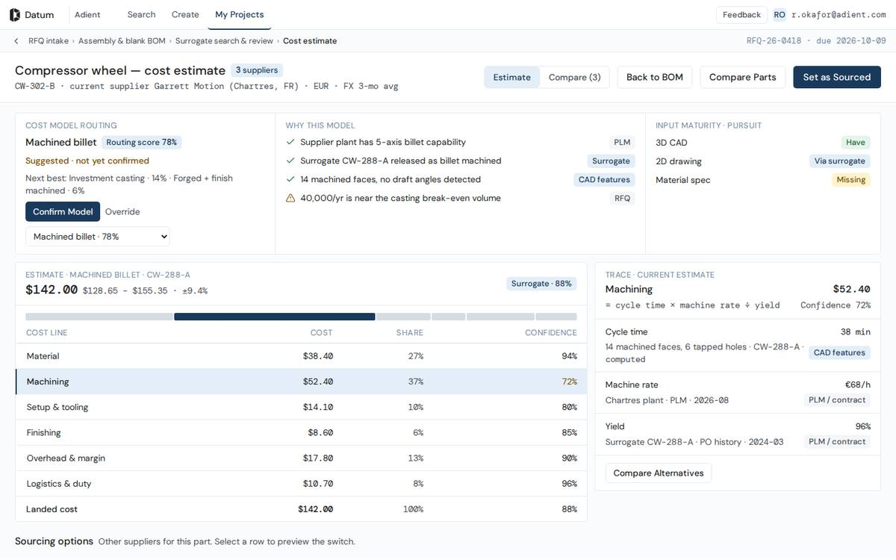
<figcaption><em>[Prototype v2]</em> Compressor wheel as machined billet: $142.00, routing confidence, six cost lines, trace panel.</figcaption>

</figure>

#### **Decided**

- **Cost model routing** shows a score, reasoning ("Why this model", each reason tagged PLM, Surrogate, CAD features, RFQ or Inputs) and the next-best list. The status starts "Suggested · not yet confirmed". The user chooses **Confirm Model** or **Override**.
- **Input maturity** per model: 3D CAD, 2D drawing, material spec, each Have, Via surrogate, Missing or Not needed. Each model has a confidence ceiling (billet and casting cap at Surrogate, forging at Estimated).
- Six fixed cost lines with share and confidence: Material, Machining, Setup and tooling, Finishing, Overhead and margin, Logistics and duty, plus landed cost.
- Trace panel for the selected line: formula, each input with value, source, freshness and a tag (CAD features, PLM or contract, Live feed, Assumed, Computed), plus a count of assumed inputs.
- Sourcing options table, cost against certainty bars, non-price factors, FX and volatility panel, an "If you switch to X" cascade preview, and a price-over-time fan chart.
- **Compare mode**: up to 3 alternates from three groups (Cost model, Surrogate CAD, Supplier), per-line deltas, Make Current, and a trace for any cell.
- A three-stage AI pipeline: similar geometry (built), PLM and metadata (partial), first-order machining and feature approximation (undesigned).
- The page flexes by path: electronics is thin (source, contract, done), mechanicals show the full reasoning chain.
- Out of scope: multi-region or multi-scenario comparison and gap-to-target walk-back.

#### **Example**

- Billet total \$142.00 (38.40 + 52.40 + 14.10 + 8.60 + 17.80 + 10.70), routing 78% billet, 14% casting, 6% forging.
- Suppliers Garrett, BorgWarner, Hunan Tyen. Rates (€68/h, 14% overhead, \$4.10 freight). "14 faces, 6 tapped".
- Range rule: ±5% at confidence 90 or above, ±9.4% at 80 or above, otherwise ±15%.

#### **Prototype simplification**

- The cost model and router: three models are hard-coded for the compressor wheel. The real system has roughly ten models, mainly casting, stamping and plastics \[AI\] \[BE\].
- CAD feature detection (cycle time, faces, tapped holes, tolerance class) is a table lookup. The ~15-input machining list is not available \[AI\].
- The sourcing table shows the same three suppliers for any surrogate line \[BE\].
- Set as Sourced only updates local state. It does not re-price BOM lines or re-run surrogate search \[BE\].
- The electronics path, Open Features and Edit Input exist only as wireframes \[FE\].
- Estimate and BOM price use different structures and differ by up to about 3% in the dataset. One canonical cost-line structure is needed \[BE\].

### 04 Program composition

Sort BOM lines into three buckets that decide what happens to requirements.
*\[Prototype v2\]*
<figure>
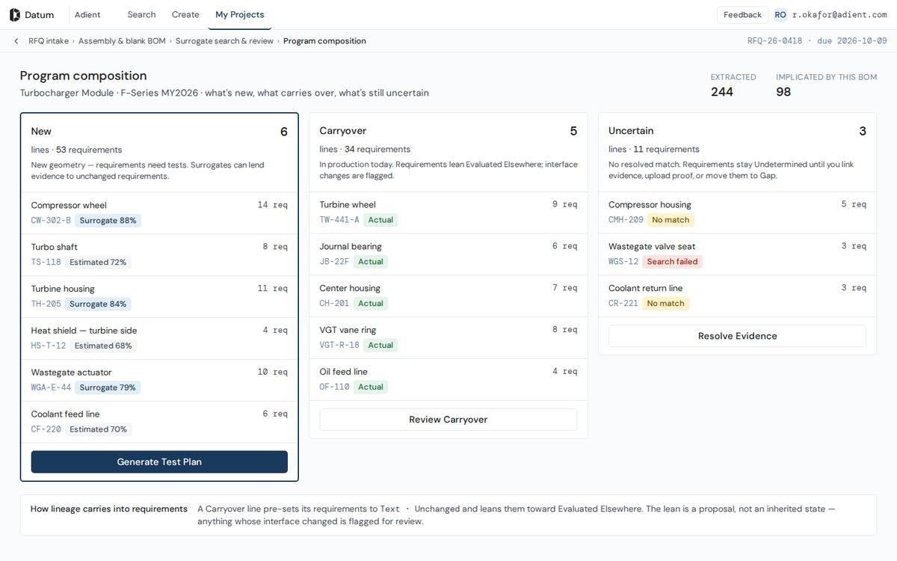
<figcaption><em>[Prototype v2]</em> New, Carryover and Uncertain, each with its primary action.</figcaption>

</figure>

#### **Decided**

- Three cards, each with a count, a note, a line list with certainty badges and one primary action: **New** (Generate Test Plan), **Carryover** (Review Carryover), **Uncertain** (Resolve Evidence).
- Rule box: a Carryover line pre-sets its requirements to Text · Unchanged and leans to Evaluated Elsewhere. The lean is a proposal, not inherited state, and a changed interface is flagged.
- The button copy follows a `planLabel` prop ("Test plan" by default, "ADV P&R" optionally).

#### **Example**

- 6 new, 5 carryover, 3 uncertain lines, covering 53, 34 and 11 requirements (98 total). Header "Extracted 244, implicated by this BOM 98".

#### **Prototype simplification**

- Per-line requirement counts are literals. The 244 to 98 reduction is not explained \[AI\].
- The mapping from certainty to bucket is not specified for the dataset (`match_type` or `provenance` are the closest fields) \[BE\].
- Whether ADV P&R is one plan or a program-wide container is undecided.

## Requirements and traceability

This is the second half of the Create workflow. It takes the requirements extracted from the RFQ, proposes a test for each new or changed one, finds existing evidence for the carried-over ones, and ends in one approval that creates the test plan. The traceability screens let a user see where a requirement came from and what depends on it.

### Vocabulary that runs through every screen

#### Two change axes per requirement

**Text**: New, Unchanged or Changed against the prior version. **Driven by**: the interface the requirement verifies, with the same three states. They are never merged. A requirement whose text is Unchanged but whose interface is Changed is the "dangerous case": it looks safe and is not. The example dataset marks three (`REC-20001`, `REC-20007`, `REC-20016`).

#### Three status vocabularies, kept apart

BOM certainty (Actual, Surrogate, Estimated, No match, Search failed). BOM carry (Carryover, New geometry, Unknown). Requirement Conformance State (Undetermined, Gap, Evaluated Elsewhere, No Gap, Not Applicable). All three are example sets. v2 renders every Conformance State except Not Applicable.

#### Provenance and confidence

Computed values carry a score and reasoning tags. User-supplied evidence is "asserted, not computed" until a reviewer verifies it. Computed pills are solid, manual and user-supplied pills are dashed. Confirming a computed Driven-by signal propagates to every requirement that shares the interface.

#### Source type tags

RFQ, Carryover, Internal, Supplier, Mfg, Regulatory, Program. v2 shows only RFQ and Carryover. Due dates are inherited from scope.

### 05 Requirement to test mapping

Review proposed requirement-to-test mappings for new and changed requirements that have no surrogate evidence.
*\[Prototype v2\]*
<figure>
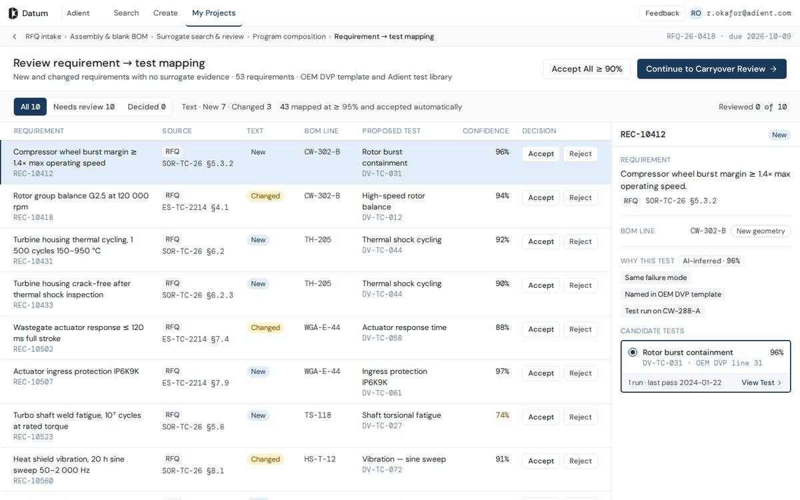
<figcaption><em>[Prototype v2]</em> Requirement table with proposed test, confidence, Accept and Reject, and the detail panel with "Why this test".</figcaption>

</figure>

#### **Decided**

- Table: Requirement, Source (tag, document, section), Text badge, BOM line, Proposed test, Confidence, Decision (Accept or Reject, then "✓ Accepted" or "Test plan needed", with Undo). Tabs All, Needs review, Decided.
- Panel order: the literal requirement clause, then source tag and citation, then a delta line for Changed rows (for example "Limit tightened G6.3 → G2.5 · no surrogate at the new limit"), then the BOM line, then **Why this test** tagged "AI-inferred · {conf}" with reasoning bullets, then candidate tests.
- The confidence in "AI-inferred" and the candidate percent are the same figure. Candidate cards are clickable and open Test detail. Selecting another candidate swaps the proposed test.
- The row and panel are one component shared with the requirement trace.
- "Tests" can be design reviews (for example "Verify by CAD analysis, not test").

#### **Example**

- The 10 rows, tags, scores, "53 requirements" and "43 mapped at ≥ 95% and accepted automatically".
- The ≥95% auto-accept and the "Accept All ≥ 90%" shortcut are example policy. Note that the banner says ≥95% accepted while two 96% and 97% rows still sit in the review list, and the 90% shortcut would also bulk-accept a Changed requirement.

#### **Prototype simplification**

- Mappings, scores, reasoning tags and the auto-accept rule are static. The test-matching agent does not exist \[AI\].
- Text state and delta come from a lookup. The requirement diff engine does not exist \[AI\] \[BE\].
- Source tag is hard-coded "RFQ" \[AI\].
- Accept and Reject have no toast and no audit record \[BE\].
- ID collision: REC-10431 is a different requirement on screen 05 and in 03c \[FE\].

### 06 Carryover review

Triage the flagged requirements where the system found, or failed to find, existing evidence, and decide each.
*\[Prototype v2\]*
<figure>
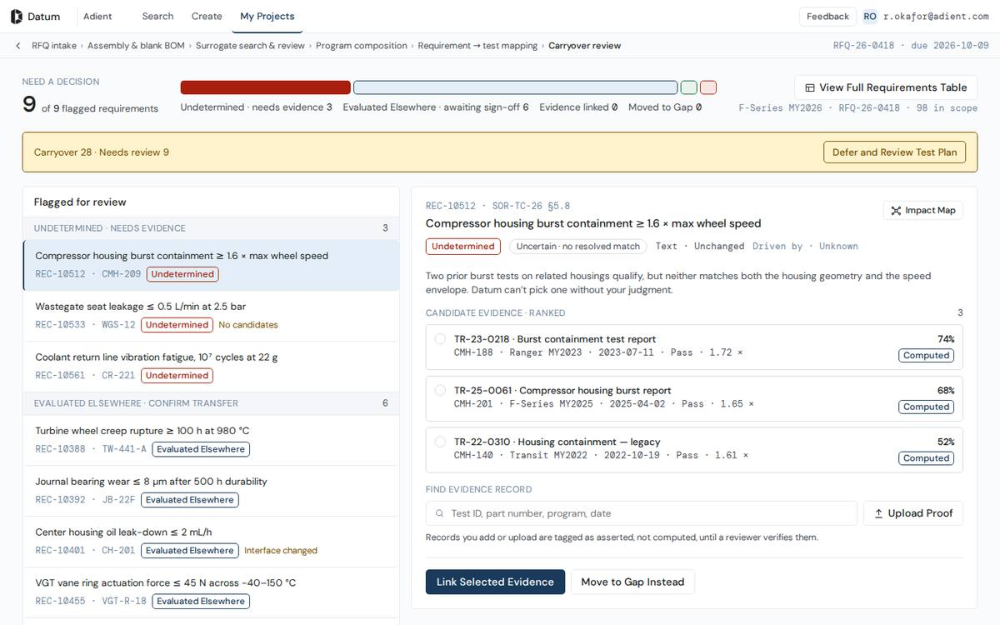
<figcaption><em>[Prototype v2]</em> "Need a decision" strip, the Undetermined and Evaluated Elsewhere lists, and ranked candidate evidence.</figcaption>

</figure>

#### **Decided**

- Triage first, with a link to the full requirements table. Two lists: **Undetermined · needs evidence** (shown first) and **Evaluated Elsewhere · confirm transfer**. Each row shows the requirement, REC and PN, Conformance State pill and a flag ("No candidates" or "Interface changed").
- **Evaluated Elsewhere panel**: lineage, Text and Driven-by states, the trail the answer comes from, "Why it transfers" tags (same part, same supplier, same standard), transfer confidence, evidence result, an interface-change warning (for example evidence taken at 4.2 bar, interface now 4.8 bar), then "Link Evidence to This Requirement" or "Move to Gap Instead", with Undo.
- **Undetermined panel**: reason, ranked candidate evidence feeding "Link Selected Evidence" (disabled until one is picked), "Find evidence record" with "Add as Candidate", and "Upload Proof", which creates a "User-supplied" record. Empty state: "Datum found no evidence record above 50%. Search for one you know about, or upload the report."
- Undetermined routes to a requirements-evidence surface, not the BOM Similarity tab. Evidence linking is single-requirement.
- Outcomes: "No Gap · evidence linked" (or "manual link", "user-supplied", shown dashed), or Gap. Primary action "Review Test Plan", or "Defer and Review Test Plan" while items remain.

#### **Example**

- All rows, evidence results, transfer confidences (71 to 96%), candidate scores, the uploaded record ("Uploaded by r.okafor").
- The 50% candidate floor.

#### **Prototype simplification**

- Candidates, scores, tags and the floor are static. Search runs over 8 hard-coded records. The evidence-matching and carryover agent does not exist \[AI\].
- Upload fabricates a record with no file. There is no evidence store, no ingestion, and no reviewer-verification flow, yet a user-supplied link still produces "No Gap" \[BE\].
- Toasts fire on link, gap and upload. There is no user and timestamp audit record \[BE\].
- Two confidences on one requirement (71% transfer on this screen, 78% computed on the trace) measure different things, and their relationship is undefined \[AI\].

### 06b Impact map

Blast radius. If a requirement, part or evidence record changes, what downstream needs review? A sibling to the carryover drawer, which answers "where did this come from".
*\[Prototype v2\]*
<figure>
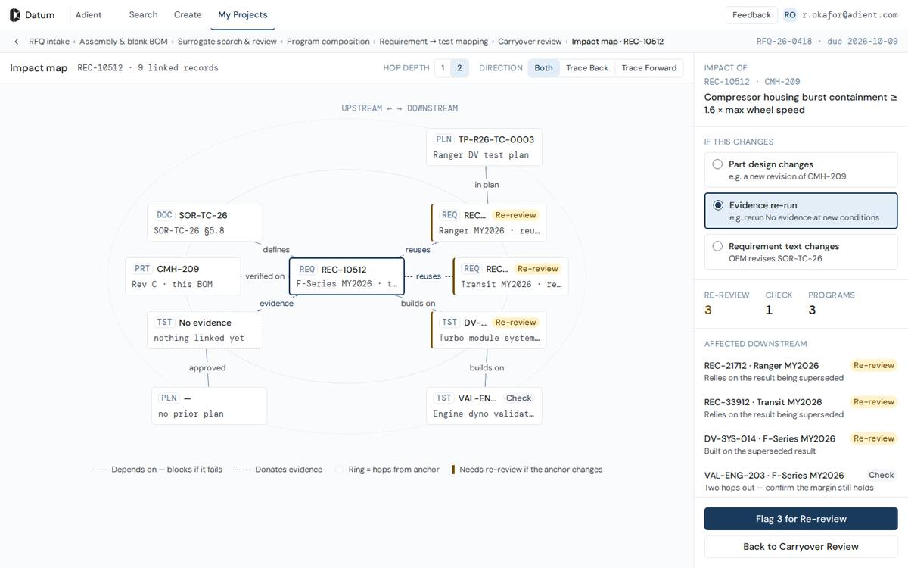
<figcaption><em>[Prototype v2]</em> Typed node graph with hop rings and the affected-downstream panel.</figcaption>

</figure>

#### **Decided**

- Single-node radius, hop depth 1 or 2, direction Both, Trace Back or Trace Forward. Typed nodes: REQ, DOC, PRT, TST, PLN. Edges: solid "Depends on, blocks if it fails", dashed "Donates evidence". Warn-bordered nodes need re-review.
- Right panel "Impact of {REC} · {PN}" with a scenario selector ("Part design changes", "Evidence re-run", "Requirement text changes"), counters RE-REVIEW, CHECK, PROGRAMS, and an "Affected downstream" list with reasons.
- Opens from Carryover review, Requirement trace and 03c.

#### **Example**

- The 10-node template, the downstream IDs, the system tests (DV-SYS-014, VAL-ENG-203) and the scenario effects.

#### **Prototype simplification**

- The dependency and impact graph service. Downstream IDs are generated by arithmetic \[BE\].
- "Flag N for Re-review" toasts "owners notified". The ownership and notification model does not exist \[BE\].
- Edge labels (defines, verified on, evidence, approved, reuses, builds on, in plan) differ from the block-diagram spec's relationship set. Contradicts and Supersedes are absent \[BE\].

### 06c Requirement trace

The full requirements table: source, change state, test and status per requirement, with the full carryover chain beneath. Reached from Carryover review.
*\[Prototype v2\]*
<figure>
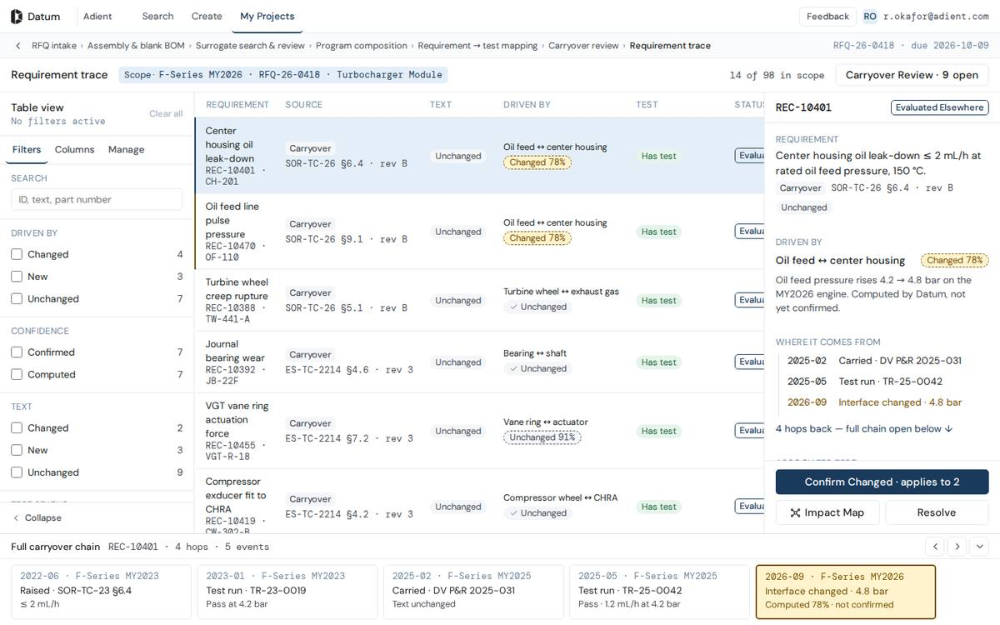
<figcaption><em>[Prototype v2]</em> Filterable trace table, detail panel and the bottom carryover chain.</figcaption>

</figure>

#### **Decided**

- Table, side panel, left sidebar (Filters, Columns, Manage) and an independent bottom drawer. Header "N of 98 in scope".
- Filters: search, Driven by, Confidence (Confirmed or Computed), Text, Test status (Has test, No test, Scope unclear), Carryover depth. Saved views "All requirements", "Look twice" (interface changed, text unchanged), "Needs a test".
- Columns: Requirement, Source, Text, Driven by (interface and state, with a percent while computed and unconfirmed, a check mark once confirmed), Test, Status, Carryover ("N hops", "1 iface Δ").
- Text has no score because it is a human-legible diff. Driven by has a score because it is computed.
- Panel: clause, source, Text badge, Driven by with percent and note, "Where it comes from", Associated test card with a warning line (for example "Run at 4.2 bar, predates the interface change") and View Test. Actions "Confirm Changed · applies to 2", "Impact Map", and "Resolve" (only where a carryover item is open).
- The bottom drawer "Full carryover chain" holds scrubbable hop cards with warn hops highlighted. It opens by default in v2.

#### **Example**

- 15 rows, interfaces, percents (41 to 91%), chains, "Confirmed by M. Hale 2026-09-24".
- The "98 in scope" figure is a literal with 15 rows behind it. Older docs cite 571.

#### **Prototype simplification**

- The interface-change computation engine and a real interface entity. Propagation is string equality on the interface name \[AI\] \[BE\].
- Source tag derives from Text (Unchanged gives Carryover, otherwise RFQ). The source-type classifier does not exist \[AI\].
- Rows with Text Unchanged and Driven by Changed get a standing warn border, independent of selection. The consolidated brief says only the selected row is highlighted. Verify visually which is intended \[FE\].
- The panel lacks the old-versus-new text diff, "flag for new test", "mark unclear" and a Driven-by override. These were in the ideas doc \[FE\].
- The requirements taxonomy (subfolders like the BOM, or hierarchy columns such as Department, Category, Sub-category) is undecided. The table is flat.
- Save Current View only toasts \[BE\].

### 03c Requirement traceability (event lanes)

A timeline of one requirement's history across programs, entered from a difference row in Compare parts.
*\[Prototype v2\]*
<figure>
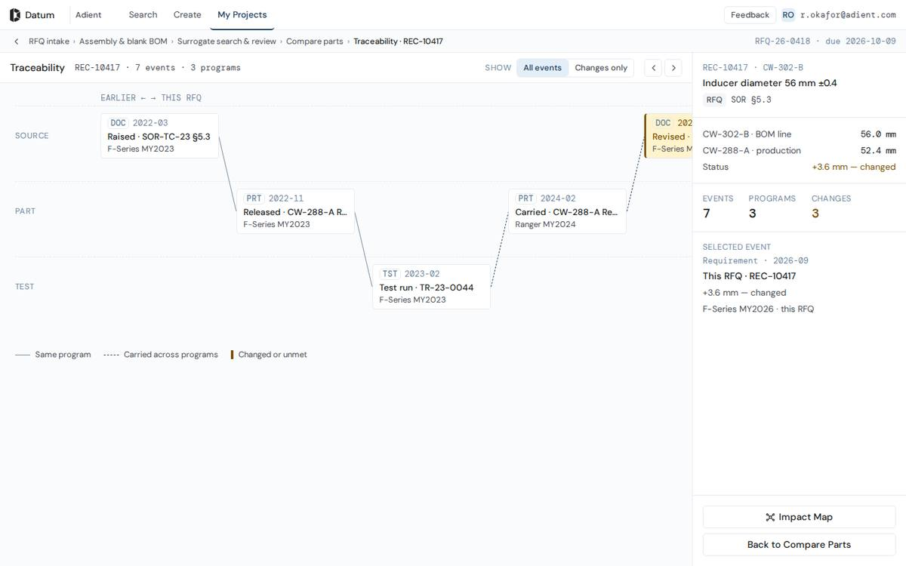
<figcaption><em>[Prototype v2]</em> Source, part and test lanes from earlier programs to this RFQ. The right edge clips at 1440px, a layout issue in the prototype.</figcaption>

</figure>

#### **Decided**

- Three lanes: DOC (source document), PRT (part record), TST (test record), running EARLIER to THIS RFQ. Edges solid within a program and dashed across programs. Warn color marks changed or unmet events.
- Toggle All events or Changes only. Previous and Next stepping, a Selected-event card, stat tiles (Status, Events, Programs, Changes), and an Impact Map action.
- Event record: when, program, lane, what, detail, warn flag.

#### **Example**

- Requirements REC-10417 to REC-10431 and their hand-written chains.

#### **Prototype simplification**

- The 8 event chains are hand-written. They are not driven by the dataset's `carryover_events.json` \[BE\].
- The block-diagram and traceability diagram are meant to be two lenses over one graph with one edge schema. This screen is not yet built on that \[BE\].

### Test detail

The single destination for every test reference, from a mapping candidate card or the trace's Associated test card.
*\[Prototype v2\]*
<figure>
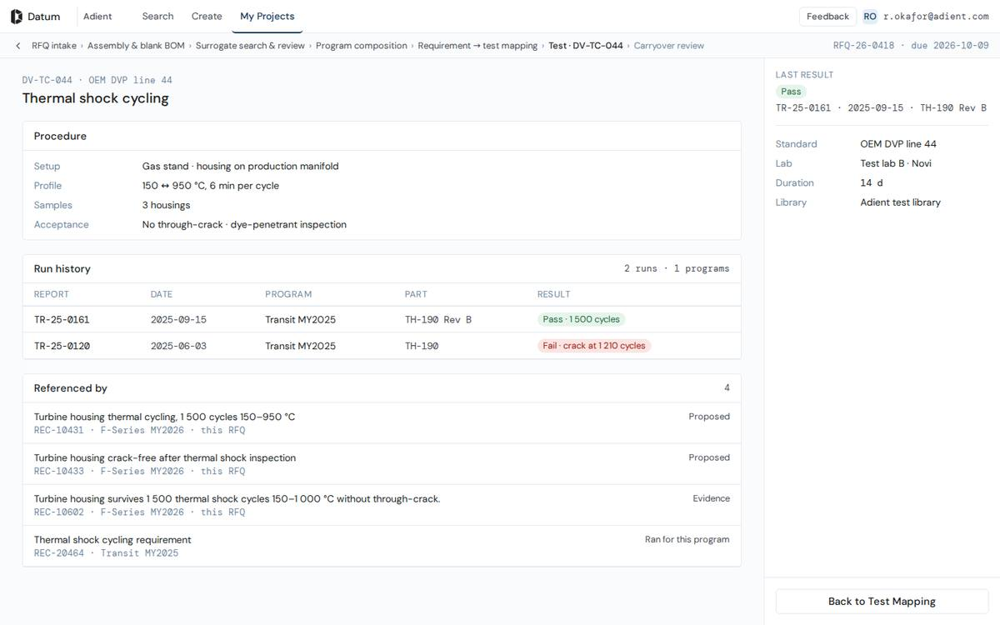
<figcaption><em>[Prototype v2]</em> DV-TC-044 thermal shock cycling: procedure, run history, referenced-by requirements.</figcaption>

</figure>

#### **Decided**

- Minimum content: Procedure (Setup, Profile, Samples, Acceptance), Run history (Report, Date, Program, Part, Result, newest first, with the empty state "Never run. This program would be the first."), and Referenced by N with a per-row state (Alternate candidate, Mapped · accepted, Mapping rejected, Proposed, Evidence, Ran for this program).
- Sidebar: Last result, Standard, Lab, Duration, Library. From a mapping row on a non-selected candidate, a "Use for {REC}" action.

#### **Example**

- Procedures, labs, durations, results (DV-TC-044 fails at 1,210 cycles, then passes on TH-190 Rev B).

#### **Prototype simplification**

- Test library and test-record system of record. Open question: pull from the client's library, or compute and store in Datum \[BE\].
- The cross-requirement usage index uses synthesized REC IDs \[BE\].

### 07 Approve and create test plan

The receipt and the single approval that commits the plan.
*\[Prototype v2\]*
<figure>
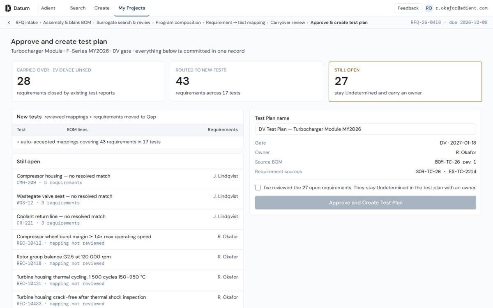
<figcaption><em>[Prototype v2]</em> Counters, still-open list with owners, plan name, acknowledgement gate.</figcaption>

</figure>

#### **Decided**

- One receipt with an acknowledgement gate. Counters: Carried over · evidence linked, Routed to new tests, Still open ("stay Undetermined and carry an owner"). New-tests table, an auto-accepted-mappings line, a Still open list with an owner per row, an editable plan name, gate, owner and source BOM.
- A checkbox ("I've reviewed the N open requirements…") enables "Approve and Create Test Plan". After creation: "Test plan created", a plan ID, Export TDM, Open in PLM.
- Counts update live from decisions on screens 05 and 06.

#### **Example**

- Gate "DV · 2027-01-18", plan ID TP-F26-TC-0007, owners J. Lindqvist, R. Okafor, M. Hale.

#### **Prototype simplification**

- Plan or ADV P&R record service and PLM write-back. The ID is hard-coded, Export TDM and Open in PLM are inert \[BE\].
- Owner assignment is hard-coded per category \[BE\].
- Baseline counts 28, 43 and 17 are literals. "Still open" also lists unreviewed or rejected mappings, and its list does not shrink as its count does \[FE\].
- No audit record of who approved and when. This is the screen where it matters most \[BE\].

## DFMEA and block diagrams

The goal is that a design-responsible engineer starts a DFMEA or DRBFM from similar prior parts instead of memory. This area is direction, not a built flow. The v2 prototype has no DFMEA screen. The earlier generation (work_v3) has hi-fi DFMEA and block-diagram screens, and the project holds a spec for the block-diagram and traceability lenses.

### DFMEA starting-point matching

Suggest similar prior DFMEAs or DRBFMs from CAD similarity, and let the user inherit the matched structure.
*\[User story\]* *\[Earlier prototype generation\]* *\[Spec\]*

#### **Decided**

- The goal: generate a starting point from similar prior parts. Boundary diagrams are generated from the CAD assembly structure.
- Matches show provenance, for example "Carried from DRBFM-1180 · feature match 6/7", using the Carried-from edge. Provenance legend: solid line human-authored, dashed AI-inferred, numeric badge for confidence.
- New block diagram offers "Compare to existing assembly" (map each part to its closest match in a released assembly and inherit that diagram) or "Create new (blank)".
- Block diagram and traceability diagram are two lenses over one graph with one edge schema. Edge types: Derived-from, Verifies, Raised-by or Resolves, Carried-from, Surrogate-for, Blocks, References, Similar-to, Informs. Contradicts and Supersedes are candidates from the Adient requirements spec.

#### **Example**

- The earlier screens kept a spatial score and a feature score separate with a "why two scores" explainer. That two-score model was superseded for search, but the pattern of explaining a number is worth keeping.
- Severity ratings and scales. The source of the severity scale is open (reuse DFMEA or define one).

#### **Prototype simplification**

- The retrieval and inheritance engine is undesigned: how prior DFMEA rows are indexed and retrieved, whether it reuses the sealed geometric engine or a separate matcher, how inherited rows are versioned and flagged, and how severity carries over \[AI\] \[BE\].
- Boundary-diagram generation from CAD structure has no algorithm \[AI\].
- DFMEA screens from the earlier generation were not part of this baseline and are not embedded here.

## Agentic architecture

The defensible asset is a proprietary geometric matching and face-mapping model. It is a trained model behind an API, not an agent. Everything that decides what to do (interpret a request, choose tools, assemble an answer, know when to stop and ask a person) is the agentic layer. That layer is built from a commodity scaffold and is meant to be replaceable and blind to the model's internals.

<figure class="diagram">
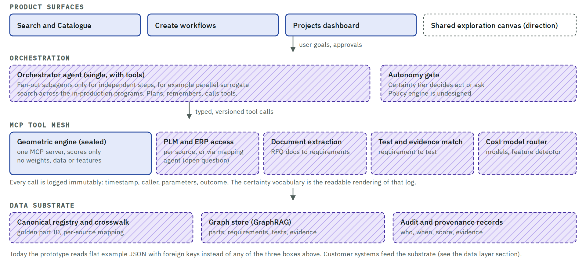
<figcaption>Solid blue boxes are specified or prototyped. Hatched boxes are undesigned and stand in for components the prototype fakes. The dashed canvas box is a direction. The sealed engine is the only part with an interface contract described in the architecture doc.</figcaption>

</figure>

### Sealed geometric engine behind MCP

Keep the proprietary model unreachable while letting any orchestrator use it.
*\[Architecture doc\]*

#### **Decided**

- The engine is wrapped in exactly one MCP server exposing only what the orchestrator needs. The orchestrator holds credentials only for that narrow surface and treats tool results as data, never instructions.
- The tool contract is the five-metric breakdown already in the UI: Geometry, Manufacture complexity, Material, Supplier / location, Order of magnitude.
- Every MCP call is logged immutably. The UI surfaces the protocol's own log rather than a separate audit trail.
- The tool schema is the versioning seam, so the engine can improve without changing the orchestrator. The engine itself is out of scope for UI work.

#### **Example**

- Tool names `find_surrogate_candidates` (part attributes in, up to N ranked candidates with scores out) and `score_pair_similarity`. Both are given as "e.g." in the doc, so names and signatures are open.

#### **Prototype simplification**

- The engine, the MCP server, schema versioning and the immutable log all do not exist here. Matches, scores and breakdowns are pre-baked rows \[AI\] \[BE\].
- Open: must the server stay on-premises or isolated in a VPC regardless of where the orchestrator runs? That constrains the scaffold choice.

### Orchestration, scaffold and substrate
*\[Architecture doc\]*

#### **Decided**

- One orchestrator with tools by default, because the product flow is one coherent pipeline with one required human sign-off. Fan-out only where steps are independent.
- The substrate is GraphRAG: retrieval of entities and relationships for multi-hop questions, not text chunks. Example paths: requirement to link to test to run, and BOM line to part to supplier. Target questions: requirements for a part, the test that verified it, what changed since last review, where else a part is used.
- The example dataset is already graph-shaped. The store is a native graph store or a relational store with graph-query support.
- Scaffold leaning, reversible: a Claude Agent SDK-style single orchestrator for MCP depth, LangGraph as the upgrade path for resumable multi-program work. Surrogate search end to end is the pilot.

#### **Example**

- Parallel surrogate search across the LX and Sport evidence sources.

#### **Prototype simplification**

- Graph store, indexer and entity resolution are undesigned. Open: batch or on-change indexing versus live traversal against source systems, and allowed staleness \[BE\].
- "Where you left off" and gate tracking are the stated trigger for checkpointing \[AI\].
- Open: cross-tenant parallel search or sequential.

### Confidence as an autonomy gate

Certainty decides how much the agent may do without a person, not only how a row is drawn.
*\[Architecture doc\]*
| Tier                                                   | What the agent may do                                                            |
|--------------------------------------------------------|----------------------------------------------------------------------------------|
| **Actual** (duplicate or quoted)                       | Carry forward into a BOM or test plan without stopping.                          |
| **Surrogate**                                          | Propose. Never finalize silently. The Approve and create step is the checkpoint. |
| **Estimated, No match, Search failed**                 | Always route to a person.                                                        |
| **Dangerous case** (text Unchanged, Driven by Changed) | The same idea for requirements: "nothing changed" is not license to skip review. |

#### **Decided**

- The principle and the rule table above. The dataset carries test cases: `ELEC-925-C` (No match), `INT-510-C` (Estimated, 55%) and the three dangerous requirements.

#### **Example**

- All thresholds (60% and 55% appear in different places). There is no documented way to set them.

#### **Prototype simplification**

- Nothing enforces the gate. The policy engine, whether it is configurable per tenant, and whether severity modulates it are undesigned \[AI\] \[BE\].

### Exploration canvas and promotion gate

The product flow is mostly linear, but exploration is not. A user may bounce between a CAD hit, a similar BOM line and a past test before committing to anything.
*\[Direction\]*
**Treat as direction.** The architecture doc text does not define a canvas layer or a promotion gate. The CAD search is specified here as a conventional linear pipeline (Files, Define, Results, Compare). Reconciling it with a shared non-linear canvas is a separate integration task. The one documented non-linear point is that a fixed handoff chain handles "No match" awkwardly, because the next step depends on what came back.

#### **Decided**

- Search is one entry point ("CAD geometry hit") into a broader exploration surface. The linear pipeline with a human sign-off at step 07 is the committed path.

#### **Example**

- The idea that explored artifacts are promoted into the linear pipeline: Confirm surrogate, Route cost, Update trace, Approve test plan.

#### **Prototype simplification**

- Undesigned: what can be promoted, who approves, what is recorded, and the canvas persistence model \[FE\] \[AI\] \[BE\].

## Data layer and dataset

### Mapping incoming data into the canonical form

Customer data arrives in each company's own statuses, field names and schemas. The decision is that the product does not hard-code them. An agent maps whatever it receives into the canonical form, and the UI renders it through configuration.

<figure class="diagram">
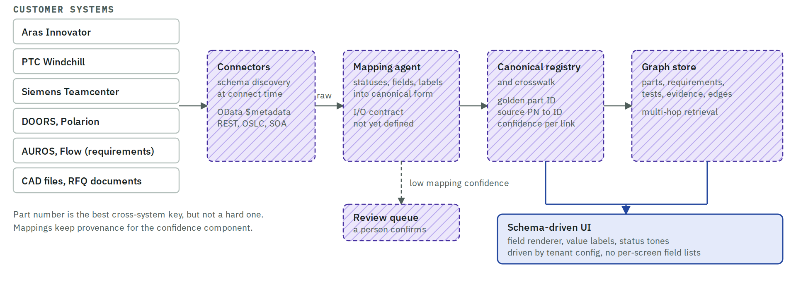
<figcaption>The research recommended per-system connectors with schema discovery. The standing decision adds a mapping agent that normalizes what the connectors return. Whether the agent replaces per-system connectors, sits above them or below them is open. The UI side is already specified: one schema-driven field renderer.</figcaption>

</figure>

### PLM and requirements systems: what the research found
*\[PLM data-source research\]*
| System             | Role                       | Part number join key                                                                         | API                                              |
|--------------------|----------------------------|----------------------------------------------------------------------------------------------|--------------------------------------------------|
| Aras Innovator     | PLM, low-code              | `item_number`, stable via `config_id`. The GUID `id` changes per revision, never join on it. | REST and OData, OAuth2                           |
| PTC Windchill      | PLM                        | `Number` on WTPart (verify uniqueness per client)                                            | Windchill REST Services (OData), most consistent |
| Siemens Teamcenter | PLM, customized with BMIDE | Contested: Item ID, Name or Revision ID, admin-configured                                    | SOA, no fixed public spec, per install           |
| IBM DOORS and Next | Requirements               | No native part number field                                                                  | Classic: DXL, CSV, ReqIF. Next: OSLC over REST   |
| Siemens Polarion   | ALM (work items)           | No native part number. IDs are project-scoped.                                               | REST (JSON:API)                                  |

#### **Decided**

- No cross-industry part-number standard exists. Use a canonical part registry with a per-source crosswalk from day one.
- Schemas vary per client install, especially Aras and Teamcenter, so the data layer discovers each tenant's schema.
- Part number search is the key behavior: tolerant of case, spacing and wildcards, with released versus study as a first-class filter that defaults to released, and data-quality signals surfaced.

#### **Example**

- The interview themes above are field evidence, not requirements to build literally.

#### **Prototype simplification**

- All of it. No connector exists. AUROS (Adient's requirements system of record, a mandatory integration target) and Flow (Rivian) have not been researched. Cooper Standard's authoritative system is unconfirmed \[BE\].

### Adient TDM statement of requirements

Client ground truth for initial requirement-table creation. It shapes the canonical schema.
*\[Signed SOR, v4, Sept 2025\]*

#### **Decided**

- **TDM** is Adient's requirements matrix. The product says "requirement table" generically and uses TDM as the Adient-tenant label.
- **K-PAC ID** is the requirement's identifier inside AUROS, and **Conformance State** is the per-requirement status. Both must round-trip on export and push.
- **Connect to Global** links a project requirement to a master requirement. Manual today, with AI-suggested matching named as the next step.
- Upload to AUROS is the one non-negotiable requirement. One sheet must match AUROS's native format exactly. Others carry OEM-specific fields, plus an "enhanced" AI-derived sheet.
- Pipeline of 8 steps (order not mandatory): input RFQ and translate, select engineering docs, identify requirements into rows, applicability, categorization, TDM format, within-project comparison (contradicting, superseding, gap), cross-project comparison. Output Excel, push to AUROS, assign-and-review approval.
- Scope is initial TDM creation only. Ongoing gap analysis and verification planning are separate.

#### **Example**

- Conformance State values (No Gap, Gap, Evaluated Elsewhere, Not Applicable). Under the configurable-status decision these are Adient's values, not canonical ones.

#### **Prototype simplification**

- RFQ extraction (OCR, translation, classification), the AUROS connector, and the contradiction and supersession engine are not built \[AI\] \[BE\].
- The prototype uses REC-style IDs. K-PAC ID and Connect to Global are absent, and TDM appears only as "Export TDM" \[FE\].

### Example dataset: Civic-class 1.5T engine, three trims

A relational seed set built to look like the real workflow: a new RFQ searches for matches among parts already in production on other programs.
*\[/data JSON files plus README\]* *\[All values are fake\]*
<figure class="diagram" style="margin-top:6px">
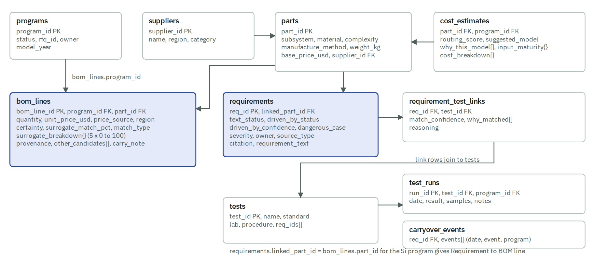
<figcaption>One flat JSON file per table, ready for bulk insert. A program's BOM is all <code>bom_lines</code> where <code>program_id</code> matches.</figcaption>

</figure>

<table>
<colgroup>
<col style="width: 20%" />
<col style="width: 20%" />
<col style="width: 20%" />
<col style="width: 20%" />
<col style="width: 20%" />
</colgroup>
<thead>
<tr class="header">
<th>Program</th>
<th>Status</th>
<th>Role</th>
<th class="num">BOM lines</th>
<th class="num">Total</th>
</tr>
</thead>
<tbody>
<tr class="odd">
<td>Civic LX 1.5T 
PGM-CIV-LX</td>
<td>In production</td>
<td>Baseline, surrogate source</td>
<td class="num">55</td>
<td class="num">$3,384.40</td>
</tr>
<tr class="even">
<td>Civic Sport 1.5T 
PGM-CIV-SPT</td>
<td>In production</td>
<td>Surrogate source</td>
<td class="num">55</td>
<td class="num">$3,609.05</td>
</tr>
<tr class="odd">
<td>Civic Si 1.5T 
PGM-CIV-SI</td>
<td>Quoting, RFQ-26-0512</td>
<td><strong>Active BOM</strong></td>
<td class="num">56</td>
<td class="num">$4,071.36</td>
</tr>
</tbody>
</table>
| Si certainty tier                               | Lines | Spend              |
|-------------------------------------------------|-------|--------------------|
| Actual (duplicate)                              | 41    | \$2,142.98 · 52.6% |
| Surrogate                                       | 13    | \$1,668.21 · 41.0% |
| Estimated (INT-510-C) | 1     | \$220.23 · 5.4%    |
| No match (ELEC-925-C) | 1     | \$39.94 · 1.0%     |
| Search failed                                   | 0     | not populated      |
78 parts, 14 suppliers, 166 BOM lines, 16 requirements (all scoped to Si), 15 tests, 25 test runs, 16 requirement-test links, 10 carryover chains, 5 cost estimates. About 41 parts are literal duplicates across all three trims. Eight turbo part families vary across all three, each with a full surrogate breakdown.

#### **Decided**

- "Search failed" has no data record. It is a process failure, and the UI shows a retry affordance.
- Severity (Critical, High, Medium, Low) and owner ship on every requirement now, so the dataset does not wait on the severity decision.
- Deliberate edge cases: one part with no surrogate (ELEC-925-C), one weak surrogate priced as Estimated (INT-510-C, 55%), three dangerous requirements, six open carryover items with a spread of severities and owners.

#### **Example**

- Everything. Prices are plausible fabrications, not real quotes. Severity scale is a placeholder.
- `price_source` has two values only (Supplier quote, Surrogate-derived estimate). Regions look like `DE-Stuttgart`. Currency is USD on every line.

#### **Prototype simplification**

- The v2 prototype does not read these files. It uses inline constants for a different product, so source labels (Quote, Surrogate PO, Model estimate), region codes, per-region currency and weight units all differ \[BE\] \[FE\].
- Missing from the dataset: per-line CAD flag, price range, lineage, BOM-level weight and volume, source and connector records, confidence for Actual lines, cost-model ceilings, a routing alternatives list.
- `surrogate_match_pct` is not the mean of the five breakdown values. It runs lower and the weighting is undefined \[AI\].
- Cost-estimate breakdown uses 3 free-text lines with High, Medium, Low confidence. The prototype uses 6 fixed lines with a numeric confidence \[BE\].
- Similarity cutoff: the prototype floor is 60%, the dataset has a 58% Surrogate and a 55% Estimated \[AI\].

## Prototype simplification register

Every place the prototype stands in for something undesigned, in one list. Role tags show who will likely own the real component. "Known I/O" is filled only where a source document states it.
| Component                                                | What the prototype does instead                           | Where it shows up                            | Owner         | Known I/O or constraint                                                                                                   |
|----------------------------------------------------------|-----------------------------------------------------------|----------------------------------------------|---------------|---------------------------------------------------------------------------------------------------------------------------|
| **Geometric matching engine and its MCP server**         | Pre-baked scores, candidates and breakdowns               | Results, Compare, BOM review, Catalogue, 03b | \[AI\]        | Part attributes in, up to N ranked candidates with the five-metric breakdown out. Typed, versioned, audit-logged. Sealed. |
| **CAD viewer and alignment solver**                      | Placeholder viewports, static PNG, simulated face picking | Define, Compare, 03b, Catalogue compare      | \[FE\] \[AI\] | View modes, linked cameras, constraint types and DOF counter are specified                                                |
| **Mapping agent, canonical registry, crosswalk**         | Fake example JSON, no mapping                             | Every screen that shows PLM or status data   | \[AI\] \[BE\] | I/O not documented. UI needs a config format for fields, labels and status tones.                                         |
| **PLM, ERP and requirements connectors**                 | Toggles, sync-time strings, disabled links                | 01 intake, Open in PLM, Files sync           | \[BE\]        | Source-specific. Aras, Windchill, Teamcenter, DOORS, Polarion, AUROS researched or named.                                 |
| **Document ingestion and requirement extraction**        | Static file list, counts and routes                       | 01 intake, 04 composition                    | \[AI\]        | Adient 8-step pipeline: RFQ docs, PDFs, images, CAD in. Rows, Excel, AUROS push out.                                      |
| **CAD assembly parser and thumbnail renderer**           | Hard-coded tree and counts                                | 01, 02, Files                                | \[BE\]        | Not documented                                                                                                            |
| **Cost model router, CAD feature detector, price feeds** | Three models for one part, lookups, constants             | 03, 03d                                      | \[AI\] \[BE\] | About ten real models. The ~15 machining inputs are not yet available.                                                    |
| **Test and evidence matching agents**                    | Static mappings, scores and a 50% floor                   | 05, 06, 03c                                  | \[AI\]        | Score, reasoning tags and ranked candidates are the visible contract                                                      |
| **Requirement diff and interface-change engine**         | Lookup tables, string-equality propagation                | 05, 06c                                      | \[AI\] \[BE\] | Text and Driven-by states, score for Driven-by only                                                                       |
| **Evidence store and test library**                      | 8 hard-coded records, fabricated uploads                  | 06, Test detail                              | \[BE\]        | Open: pull from the client's library or compute and store                                                                 |
| **Graph store, GraphRAG and impact service**             | Fixed 10-node template, hand-written chains               | 06b, 03c, 06c                                | \[BE\]        | Edge schema shared by block-diagram and traceability lenses                                                               |
| **Autonomy gate (policy engine)**                        | None. Nothing blocks.                                     | Everywhere                                   | \[AI\] \[BE\] | Rule table by certainty tier. Per-tenant configuration and severity are open.                                             |
| **Audit trail, ownership, notifications**                | Toasts only                                               | Results approvals, 05, 06, 06b, 07           | \[BE\]        | Record time and who. Owners notified.                                                                                     |
| **Confidence and provenance record**                     | Per-screen constants                                      | Every screen                                 | \[BE\] \[FE\] | Needs a uniform payload: score or scores, type, evidence, last-verified, confirmation with actor and time                 |
| **Plan record service, TDM export, PLM write-back**      | Hard-coded plan ID, inert buttons                         | 07                                           | \[BE\]        | AUROS push must round-trip K-PAC ID and Conformance State                                                                 |
| **Persistence: projects, saved searches, saved views**   | In-memory state, toasts                                   | My Projects, Save Search, Save View, Manage  | \[BE\]        | Not documented                                                                                                            |
| **Dashboard services**                                   | Not built                                                 | Projects dashboard, Home recents             | \[BE\]        | Activity log, aggregation by zoom level, connection health, deadlines                                                     |
| **Search index**                                         | Static lists                                              | Files, Home search, Catalogue                | \[BE\]        | Part-number first. Case, spacing and wildcard tolerant. Released by default.                                              |
| **DFMEA retrieval and inheritance**                      | Not in v2                                                 | DFMEA, block diagram                         | \[AI\] \[BE\] | Not documented                                                                                                            |

## Conflicts and open questions

### Where sources disagree

These are mismatches between documents or between a document and the prototype. Resolve them before building to either side.
| Topic                                            | What disagrees                                                                                                                                                             | This document follows                                                   |
|--------------------------------------------------|----------------------------------------------------------------------------------------------------------------------------------------------------------------------------|-------------------------------------------------------------------------|
| Navigation shell                                 | v2 brief and screens: top nav plus breadcrumb, no sidebar. Search PRD: left nav with Search, Create, My Projects, Settings.                                                | Left nav (Aaron's decision)                                             |
| Product in the examples                          | Prototype screens: Turbocharger Module, RFQ-26-0418, 14 lines. Dataset: Civic engine, RFQ-26-0512, 56 Si lines.                                                            | Both are examples. Wire the dataset in to replace the inline constants. |
| Certainty tiers and the three quality dimensions | BOM screens use a five-tier certainty vocabulary. The search PRD uses confidence, similarity and data type, and calls the older vocabulary historical where they conflict. | Tiers are example values for the data type dimension. Confirm this.     |
| Similarity cutoff                                | Prototype floor 60% (45% loosened). Dataset Surrogate at 58%, Estimated at 55%.                                                                                            | Configurable. No fixed value.                                           |
| Requirement counts                               | Intake extracts 148 + 96 = 244. Downstream scope is 98. Older docs cite 571 for the trace table.                                                                           | Example data. The reduction needs an explanation.                       |
| Two confidences on one requirement               | Transfer confidence 71% (06) and computed 78% (06c) for the same requirement.                                                                                              | Different quantities. Define the relationship.                          |
| Standing highlight on dangerous rows             | Code gives every Unchanged-text, Changed-driver row a warn border. The brief says only the selected row is highlighted.                                                    | Verify visually which is intended.                                      |
| Toasts and audit                                 | The brief says no toasts were observed. v2 fires toasts on link, gap, upload, confirm, flag and plan create. None writes an audit record.                                  | Toasts exist. Audit record is still required.                           |
| Edge vocabulary                                  | Impact map labels differ from the block-diagram spec. Contradicts and Supersedes are absent.                                                                               | Converge on the spec's edge schema.                                     |
| Per-PLM connectors and the mapping agent         | The architecture doc recommends one MCP server per client PLM system. The standing decision has an agent mapping data to canonical form.                                   | Mapping agent. Relationship to connectors is open.                      |
| Integration guide                                | The oldest RFQ-to-ADV-P&R guide says to skip intake and lists mapping review and receipt as gaps.                                                                          | Superseded. v2 builds intake, mapping review, impact map and receipt.   |
| Source labels, regions, currency, units          | Prototype and dataset use different values for each.                                                                                                                       | Configurable. Pick canonical forms when wiring the dataset.             |

### Open questions

#### Data and AI

- Mapping agent: inputs, outputs, canonical schema, the review path when mapping confidence is low, and whether tenant-specific fields like K-PAC ID survive round trips.
- Is the mapping agent a replacement for per-PLM connectors, a layer above them, or below them? Where does schema discovery live?
- Weighting that turns the five similarity dimensions into one percentage.
- Does the geometric MCP server need to stay on-premises or isolated regardless of where the orchestrator runs?
- Graph indexing: batch or on change versus live traversal. Allowed staleness.
- Does severity modulate the autonomy gate, and which severity scale?
- Where is the promotion gate defined, and what can be promoted from the canvas?
- AUROS and Flow integration research is missing.

#### Design

- Which certainty and match-quality model is canonical. Should stale references and unconfirmed matches look different?
- Does a duplicate need its own badge tier, or stay text in the Similarity tab?
- Requirements taxonomy: subfolders like the BOM, or hierarchy columns.
- Is ADV P&R one plan or a program-wide container?
- Alignment in Compare: block or warn when under-constrained, and real constraint inference or user-chosen type.
- Should evidence linking propagate like Driven-by confirmation? Multi-select impact comparison.
- Dashboard: confirm "HW level" as the third zoom tier, the overflow table shell, and the source of "Where you left off".
- Is "change suppliers" a real action that re-prices and re-sources, or read-only?
- Owner earlier in the flow, and a source for severity.
Resolved and no longer open: the left-nav IA, feedback modal and Jira behavior, both entry flows, the three-dimension match quality, Review required as a workflow status, approval with audit trail, row actions, Search on in a new tab, Use This Part as a context-driven decision action, catalogue compare in two forms, the Create label, tree plus filters with filters narrowing the tree, configurable PLM schema, fully configurable Reuse Status, and fake example data.

## Sources

- **Search and catalogue:** the 3D CAD Search design requirements PRD (v2.3), the four design-file bundles (part_vs_assembly, cad_compare, file_selection, homepage_search), the Part Catalogue bundle (Bolt Finder Prototype, Parts Catalogue canvas), and the 30-second screen recording of the live beta.
- **Create workflows:** the Handoff v2 prototype ("RFQ to Test Plan v2", 13 labeled screens, plus Cost Estimate Wireframes), the consolidated v2 design brief, and the design briefs for assembly-to-BOM creation, BOM detail view, BOM flow notes, cost estimation, requirement-to-test mapping, requirement trace cleanup and carryover updates, requirements tracing ideas, program-focused requirements, validation redesign ideas, block-diagram traceability, and navigation and table decisions.
- **Data and AI:** the agentic AI integration architecture doc, the PLM data-source research, the Adient TDM statement of requirements summary, the confidence and provenance design principle, the projects dashboard low-fi brief, the user stories, and the example BOM dataset with its README.
- **Snapshots:** real-app frames come from the screen recording and pasted screenshots. Concept frames are artboards from the catalogue files. Prototype frames were rendered from the v2 prototype at 1440 px wide after running its surrogate search. Click any image to enlarge it.

Prototype behavior in this document was read from the prototype's source and from rendered screens. Where code and brief disagree, both are stated.
